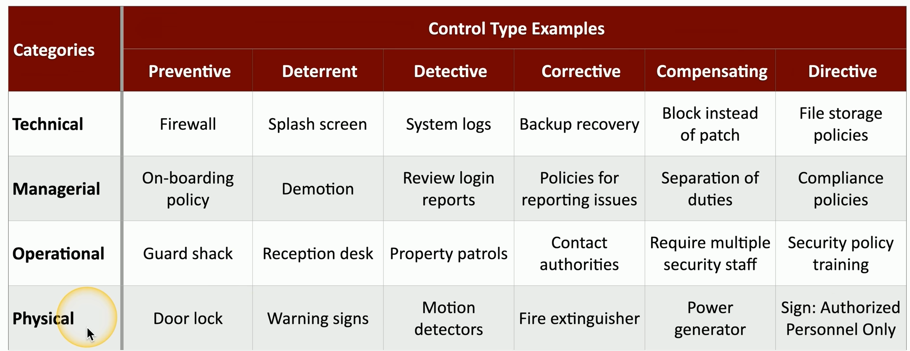
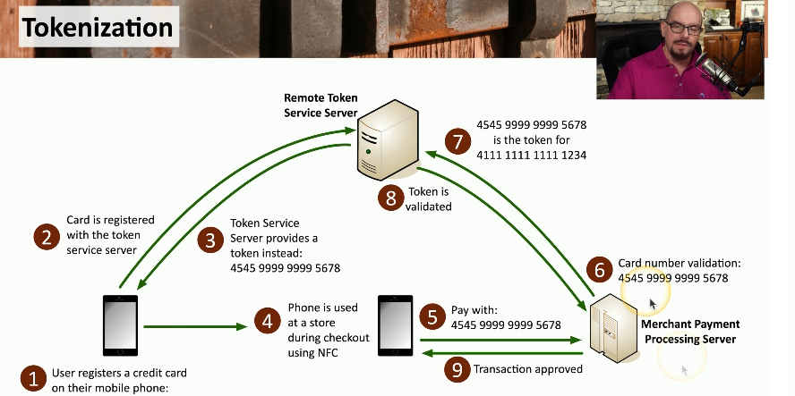
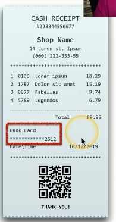
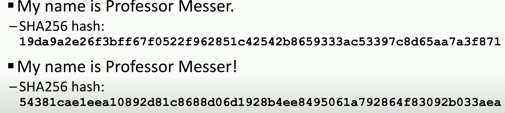
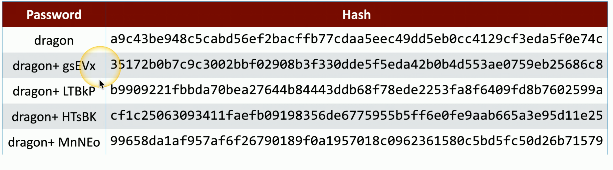

# Security Controls
<u>Technical Controls</u>: controls implemented using systems (i.e. OS system controls, firewalls, antivirus)

<u>Managerial Controls</u>: administrative controls associated with security design and implementation (i.e. security policies, SOPs)

<u>Operational Controls</u>: controls implemented by people instead of systems (i.e. security guards, awareness programs)

<u>Physical Controls</u>: controls that limit physical access (i.e. guard shack, fences, locks, badge readers)

#### Control Types
<u>Preventive</u>: prevent security incidents from happening (i.e. firewalls, passwords, biometrics, IPS, security policies and procedures)
<u>Deterrent</u>: discourage attackers from attempting to compromise a system. Make and attacker think twice (i.e. warning signs, security guards, CCTV)  
<u>Detective</u>: detect and alert on security incidents as the occur (i.e. Intrusion Detection Systems (IDS), Security Information and Event Management Systems (SIEM), Audit logs and monitoring, surveillance cameras)
<u>Corrective</u>: correct and mitigate the impact of security incidents (i.e. anti-virus/anti-malware software, backup and recovery procedures, patch management systems, incident response plans) 
<u>Compensating</u>: security measures implemented to provide an alternative method of protecting assets when standard controls aren't enough (i.e. temporary access restrictions, additional monitoring when primary controls are down) 
<u>Directive</u>: directing a subject towards a security compliance (i.e. security policies and guidelines, employee handbooks, SOPs)

# CIA Triad
<u>Confidentiality</u>: certain information should only be known to certain people. You prevent disclosure of information to unauthorized individuals 

<u>Integrity</u>: data is stored and transferred as intended. Any modification to the data would be identified

<u>Availability</u>: information is accessible to authorized users

# Non-repudiation
<u>Non-repudiation</u>: proof that an action or transaction occurred and that the sender cannot deny having performed it

<u>Key Stretching</u>: the process of strengthening a key by performing multiple processes on it. The same key is hashed multiple times creating a more complex string of text every time. This makes brute-force attacks and other password cracking techniques more difficult and time-consuming.

- Prove the message was not changed = Integrity  
- Prove the source of the message = Authentication  
- Make sure the signature is not fake = Non-repudiation

# Authentication, Authorization, & Accounting
 - Identification = this is who you claim to be  

 - Authentication = prove you are who you say you are  
    - You can authenticate a device using digital signatures. This is done using certificates that other organizations rely on
        - The certificate authority is how certificates are signed and are maintained by the organization. It validates the certificate.

 - Authorization = based on identification and authentication, what access do you have?
    - An authorization model is used to grant access to users and services (i.e. groups, roles, etc.) 

 - Accounting = log/track everything that goes on (i.e. login time, data sent and received, logout time)

# Gap Analysis
<u>Gap Analysis</u>: compare where you are with where you want to be  

# Zero Trust
<u>Zero Trust</u>: Assumes threats can exist inside or outside the network, requiring authentication for all entities. 

- You can apply Zero Trust framework by splitting the network into functional components/planes
    - <u>Data Plane</u>: responsible for forwarding and processing traffic in a network
    - <u>Control Plane</u>: manages data plane actions (i.e define policies & rules, routing tables, session tables, NAT tables)

- You can control trust within a network by:
    1. <u>Adaptive Identity</u>: authentication method that adjusts based on factors like location, behavior, and context (i.e. 
a user located in China requesting access to a resource located in the U.S.)
    2. <u>Threat scope reduction</u>: decrease the number of entry points in a network
    - Combining these 2 results in policy driven access control

<u>Policy Decision Point (PDP) </u>: makes authorization decisions based on predefined policies. It interprets rules and decides whether access requests should be allowed or denied
<u>Policy Administrator</u>: the role responsible for developing, implementing, and maintaining policies, standards, guidelines, and procedures 
<u>Policy Enforcement Point</u>: enforces security policies by allowing and blocking traffic based on predefined rules

#### Zero Trust Policy Plane

# Physical Security
- Barricades/bollards, moats, etc.
- <u>Access control vestibules</u>: room where doors are unlocked/locked in order to keep others out
- Fences
- Video surveillance
- Security guards
- Lighting
- Sensors

# Deception and Disruption
- <u>Honeypot</u>:  decoy system or resource designed to attract and trap cyber attackers. It looks like a legit part of a network but its isolated and monitored to gather information about attacker's tactics, technique, and motives

- <u>Honeynet</u>: a network of honeypots that are interconnected  to simulate a larger and more realistic environment. It allows organizations to capture and analyze broader attacker patterns and behaviors

- <u>Honeyfile</u>: a file or document created and placed in a network to act as bait. It contains seemingly valuable information that, if accessed or modified, triggers alerts and provides insights into unauthorized access attempts

- <u>Honeytokens</u>: traceable data added to a honeynet in order to see who accessed a network

# Change Management
- <u>Change approval process</u>: formal process for managing changes
    - Typical Process:
        - Complete request form
        - Determine the purpose of the change
        - Identify the scope of the change
        - Schedule a date and time of the change
        - Determine affected systems and the impact
        - Analyze the risk associated with the change
        - Get approval from the change control board
        - Get end user acceptance after the change is complete

- <u>Owners</u>: individual or entity that needs to make a change
    - The owner manages the process but doesn't usually perform actual changes

- <u>Sandbox test</u>: isolated environment used to test and analyze files or changes

# Technical Change Management
- <u>Allow/deny lists</u>: lists used to determine which applications are allowed or not allowed to work in a environment (i.e. app that is known for having multiple vulnerabilities)
    - <u>Allow</u>: determines what applications can be ran (its really restrictive)
    - <u>Deny</u>: determines what application can NOT be ran (i.e. anti-virus, anti-malware)
- <u>Change Control Approval</u>: defines exactly which components are covered
    - It doesn't mean you can make any change. Its very specific.
    - Modifications to related components are allowed provided they remain within the defined scope of the approved change

# Public Key Infrastructure
- <u>Public Key Infrastructure (PKI)</u>: a framework of policies, procedures, and technologies used to manage digital certificates and public key encryption. It provides a secure and reliable way to verify the authenticity of digital entities (i.e. users, devices, servers) on a network 

- <u>Symmetric Encryption</u>: uses a single key for both encryption and decryption of data. 
    - The same key must be securely shared and kept secret between the communicating parties. This method is efficient and faster than asymmetric encryption
- <u>Asymmetric</u>: 2 keys where one is for encryption and the other is for decryption
    - Private key = decrypts data
    - Public key (anyone can see this) = encrypts data
    - Anyone with the public key can encrypt and send data to you
    - You can not derive the private key from the public key

# Encrypting Data
- Its possible to encrypt databases specifically:
    - Encrypting all db information with a symmetric key
    - Encrypting individual columns 

- Larger keys are more secured since they are more complex making it more difficult for attackers to brute force. This applies to symmetric and asymmetric keys

- Weak keys can be strengthened by performing multiple processes. For example, hash a password, hash the hash of the password and so on. This would require the attacker to go spend a lot more time

# Key Exchange
- Keys can be sent to others either out-of-band or in band
    - Out-of-band exchanges involve sending keys not within your network (i.e. telephone, courier, in-person, etc.)
    - In-band exchanges involve sending keys within your network (i.e. asymmetric encryption to deliver symmetric keys)  
        <u>Process of sharing a symmetric session key using asymmetric encryption</u>  
            1. Client encrypts a random key (symmetric) with a server's public key  
            2. The server decrypts this shared key and uses it to encrypt data (this is the session key)  
    - Session keys are temporary and should be unpredictable
    

# Encryption Technologies
- <u>Trusted Platform Module (TPM)</u>: a security chip on a computer's motherboard designed to enhance security by securely storing cryptographic keys. It basically provides encryption for a single device

- <u>Hardware Security Module (HSM)</u>: an external device used to store cryptographic keys. Its used for large amounts of data.

- <u>Key Management System</u>: way to manage all keys in a centralized manager (i.e. AWS Key Management Service)

- <u>Secure Enclave</u>: a physically isolated area within a device dedicated to storing and processing sensitive data securely 
    - It uses cryptography and hardware level isolation to keep that data safe even if the main system is compromised

# Obfuscation
- <u>Obfuscation</u>: the process of making something unclear in order to hide data (i.e. hiding information inside an image)
    - Its possible to read the information if you know how
    - Common Steganography Techniques
        1. Network based: embed messages in TCP packets
        2. Use an image: embed the message in the image itself
        3. Invisible watermarks: yellow dots on printers
    - There is also audio and video steganography

- <u>Tokenization</u>: replace sensitive data with a non-sensitive placeholder 
    - Example: SSN=266-12-1112 is now 691-61-8539
    - The token is temporary so an attacker can not use it later
    - There is no encryption or hashing since the sensitive information is replaced
    

- <u>Data Masking</u>: technique used to protect sensitive data by replacing it with fictitious but realistic data. 
    - This ensures data can not be deciphered even if an attacker has gained access to the masked data 
    - Example
    

# Hashing and Digital Signatures
- <u>Hash</u>: a one way trip that represents data as a short string of text. Its like a digital fingerprint.
    - Its impossible to recover the original message 
    - Its used to store passwords (confidentiality)
    - It can be used to verify a downloaded document is the same as the original
    - Examples:
    

- <u>Salt</u>:  technique used to strengthen the security of hashed passwords or other data by adding a random value (aka salt) to the input before hashing. This random value ensures that even if 2 users have the same password, their hashed values will differ
    

- <u>Digital signatures</u>:  cryptographic mechanism used to verify the authenticity and integrity of digital messages or documents. It proves that the message or document was created by the sender (authentication) and has not been altered since it was signed (integrity)
    - Proves the message was not changed (Integrity)
    - Proves the source of the message (Authentication)
    - Proves the signature is not fake (Non-repudiation)

# Blockchain Technology
- <u>Blockchain</u>: stores and records events (i.e. financial transactions) in the order they occur using secure, tamper resistant chain of data blocks
    - Keeps track of transactions.Its like a distributed ledger.
    - Everyone on the blockchain network maintains the ledger
    - Its used for payment processing, digital identification, digital voting
    - Transactions are sent to every computer in the network
    - If a change is made, the hashes in the chain are changed and recalculated. The recalculated changes will no longer match the chains stored by the rest of the network and will be rejected

# Certificates
- <u>Digital Certificate</u>: a file that contains both a public key and digital signature. It verifies the identity of a user, device, or server

- <u>Root of Trust</u>: the most trusted part of a system that ensures hardware, software, and communications are secure and valid
    - Its used to start a chain of trust by verifying that each layer of the system can be trusted before allowing is to run
    - Example: Its like a inspector checking (i.e.verifying hardware and software) a building (i.e. computer system) before it can be used

- <u>Certificate Authority (CA)</u>: A trusted organization that issues and manages digital certificates. It uses these certificates to identify a user, device or server so they can be trusted on the network
    - The CA signs the certificates of the website and the browser trusts the CA connecting the user to the website

- <u>Private Certificate Authorities</u>: organization or system that acts as its own certificate authority for internal use

- <u>Self-signed certificate</u>: digital certificate signed by the entity that created it

- <u>Wildcard certificate</u>: certificate that can be configured to support many different domains
    - A wildcard domain will apply to all server names in a domain

- <u>Certificate Revocation List (CRL)</u>: list of revoked certificates kept on the CA

- <u>Online Certificate Status Protocol (OSCP) stapling</u>: protocol used to obtain the current status of a digital certification in real-time