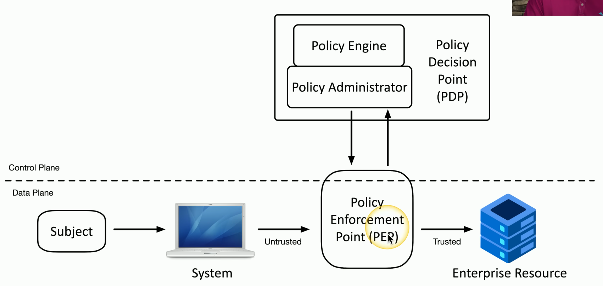

# Security Controls
<u>Technical Controls</u>: controls implemented using systems (i.e. OS system controls, firewalls, antivirus)

<u>Managerial Controls</u>: administrative controls associated with security design and implementation (i.e. security policies, SOPs)

<u>Operational Controls</u>: controls implemented by people instead of systems (i.e. security guards, awareness programs)

<u>Physical Controls</u>: controls that limit physical access (i.e. guard shack, fences, locks, badge readers)

#### Control Types
<u>Preventive</u>: block access to a resource  
<u>Deterrent</u>: discourage an intrusion attempt. Makes an attacker think twice  
<u>Detective</u>: identify and log an intrusion  
<u>Corrective</u>: apply a control after an event has been detected. You can reverse the impact of an event  
<u>Compensating</u>: control using other means. Its a temporary solution used to makeup the lack of resources you currently have  
<u>Directive</u>: direct a subject towards a security compliance. Its pretty weak security control since it relies on the subject to make the decision

# CIA Triad
<u>Confidentiality</u>: certain information should only be known to certain people. You prevent disclosure of information to unauthorized individuals 

<u>Integrity</u>: data is stored and transferred as intended. Any modification to the data would be identified

<u>Availability</u>: information is accessible to authorized users

# Non-repudiation
<u>Non-repudiation</u>: proof that an action or transaction occurred and that the sender cannot deny having performed it

- To prove the integrity of data, hashing can be used. It represents the data as a short string of text. If the data changes so will the hash. If the hash changes, it indicates the data has bee compromised

- Prove the message was not changed = Integrity  
- Prove the source of the message = Authentication  
- Make sure the signature is not fake = Non-repudiation

# Authentication, Authorization, & Accounting
 - Identification = this is who you claim to be  

 - Authentication = prove you are who you say you are  
    - You can authenticate a device using digital signatures. This is done using certificates that other organizations rely on
        - The certificate authority is how certificates are signed and are maintained by the organization. It validates the certificate.

 - Authorization = based on identification and authentication what can access do you have?
    - An authorization model is used to grant access to users and services (i.e. groups, roles, etc.) 

 - Accounting = resources used include login time, data & received, logout time

# Gap Analysis
<u>Gap Analysis</u>: compare where you are with where you want to be  

# Zero Trust
<u>Zero Trust</u>: framework that assumes no one inside or outside a network should be automatically trusted. It emphasizes verifying every user and device, regardless of location, before granting access to resources

- You can apply Zero Trust framework by splitting the network into functional components/planes
    - <u>Data Plane</u>: process the frames, packets and network data (i.e. processing, forwarding, trunking, encrypting, NAT)
    - <u>Control Plane</u>: manages the actions of the data plane (i.e define policies & rules, routing tables, session tables, NAT tables)

- You can control trust within a network by:
    1. <u>Adaptive Identity</u>: security approach that dynamically adjusts security measures based on the level of risk associated with a user's login attempt (i.e. a user requesting access to a resource located in the U.S.from China)
    2. <u>Threat scope reduction</u>: decrease the number of entry points  
    - Combining these 2 results in policy driven access control

#### Zero Trust Policy Plane

# Physical Security
- Barricades/bollards, moats, etc.
- <u>Access control vestibules</u>: room where doors are unlocked/locked in order to keep others out
- Fences
- Video surveillance
- Security guards
- Lighting
- Sensors

# Deception and Disruption
- <u>Honeypot</u>: its a decoy meant to attract and trap cyber attacks allowing professionals to study their tactics and tools

- <u>Honeynet</u>: 1 or more honeypots meant to make a network look more real

- <u>Honeyfile</u>: create files with fake information

- <u>Honeytokens</u>: traceable data added to a honeynet in order to see who accessed a network

# Change Management
- <u>Change approval process</u>: formal process for managing changes
    - Typical Process:
        - Complete request form
        - Determine the purpose of the change
        - Identify the scope of the change
        - Schedule a date and time of the change
        - Determine affected systems and the impact
        - Analyze the risk associated with the change
        - Get approval from the change control board
        - Gen end user acceptance after the change is complete

- <u>Owners</u>: individual or entity needs to make a change
    - The owner manages the process but doesn't usually perform actual changes

- <u>Sandbox test</u>: isolated environment used to test and analyze files or changes

# Technical Change Management
- <u>Allow/deny lists</u>: lists used to determine which applications are allowed or not allowed to work in a environment (i.e. app that is known for having multiple vulnerabilities)
    - <u>Allow</u>: determines what applications can be ran (its really restrictive)
    - <u>Deny</u>: determines what application can NOT be ran (i.e. anti-virus, anti-malware)
- <u>Change Control Approval</u>: defines exactly which components are covered
    - It doesn't mean you can make any change. Its very specific.
    - Modifications to related components are allowed provided they remain within the defined scope of the approved change

# Public Key Infrastructure
- <u>PKI</u>: system used to grant access to people and systems using public accessible keys

- <u>Symmetric Encryption</u>: a single key used for encryption and decryption.
    - Its sometimes called a shared secret
- <u>Asymmetric</u>: 2 keys where one is for encryption and the other is for decryption
    - Private key = decrypts data
    - Public key (anyone can see this) = encrypts data
    - Anyone with the public key can encrypt and send data to you
    - You can not derive the private key from the public key

- <u>PKI</u>: system used to grant access to people and systems using public accessible keys

# Encrypting Data
- Its possible to encrypt databases specifically:
    - Encrypting all db information with a symmetric key
    - Encrypting individual columns 

- Larger keys are more secured since they are more complex making it more difficult for attackers to brute force. This applies to symmetric and asymmetric keys

- Weak keys can be strengthened by performing multiple processes. For example, hash a password, hash the hash of the password and so on. This would require the attacker to go spend a lot more time

# Key Exchange
- Keys can be sent to others either out-of-band or in band
    - Out-of-band exchanges involve sending keys not within your network (i.e. telephone, courier, in-person, etc.)
    - In-band exchanges involve sending keys within your network (i.e. asymmetric encryption to deliver symmetric keys)
        - Process of sharing a symmetric session key using asymmetric encryption
            1. Client encrypts a random (symmetric) key with a server's public key
            2. The server decrypts this shared key and uses it to encrypt data (this is the session key)
    - Session keys are temporary and should be unpredictable
    

# Encryption Technologies
- <u>Trusted Platform Module (TPM)</u>: a security chip on a computer's motherboard designed to enhance security by securely storing cryptographic keys. It basically provides encryption for a single device

- <u>Hardware Security Module (TPM)</u>: way to provide encryption for large amounts of data (not just 1 device)

- <u>Key Management System</u>: way to manage all keys in a centralized manager (i.e. AWS Key Management Service)

- <u>Secure Enclave</u>: a physically and logically isolated area within a device that stores and processes sensitive data securely (i.e. encryption keys, passwords, or biometric info). It uses cryptography and hardware level isolation to keep that data safe even if the main system is compromised

# Obfuscation
- <u>Obfuscation</u>: the process of making something unclear in order to hide data (i.e. hiding information inside an image)
    - Its possible to read the information if you know how
    - Common Steganography Techniques
        1. Network based: embed messages in TCP packets
        2. Use an image: embed the message in the image itself
        3. Invisible watermarks: yellow dots on printers
    - There is also audio and video steganography

- <u>Tokenization</u>: replace sensitive data with a non-sensitive placeholder 
    - Example: SSN=266-12-1112 is now 691-61-8539
    - The token is temporary so an attacker can not use it later
    - There is no encryption or hashing since the sensitive information is replaced
    

- <u>Data Masking</u>: technique used to protect sensitive data by replacing it with fictitious but realistic data. 
    - This ensures data can not be deciphered even if an attacker has gained access to the masked data 
    - Example
    

# Hashing and Digital Signatures
- <u>Hash</u>: a one way trip that represents data as a short string of text. Its like a digital fingerprint.
    - Its impossible to recover the original message 
    - Its used to store passwords/confidentiality
    - It can be used to verify a downloaded document is the same as the original
    - Examples:
    

- <u>Salt</u>: random data added to a password when hashing
    - The same password results in different hashes
    

- Digital signatures
    - Proves the message was not changed (Integrity)
    - Proves the source of the message (Authentication)
    - Proves the signature is not fake (Non-repudiation)

# Blockchain Technology
- <u>Blockchain</u>: keeps track of transactions.Its like a distributed ledger.
    - Everyone on the blockchain network maintains the ledger
    - Its used for payment processing, digital identification, digital voting
    - Transaction are sent to every computer in the network
    - If a change is made, the hashes in the chain are changed and recalculated. The recalculated changes will no longer match the chains stored by the rest of the network and will be rejected

# Certificates
- <u>Digital Certificate</u>: binds a public key with a digital signature and other details about the key holder

- <u>Root of Trust</u>: a trusted part of a computer (i.e. special chip or secure software) that the system relies on to start up securely and check that everything else is safe to run. Its the first thing the system trusts and everything else must prov it's safe before being allowed to run
    - Its like a security guard for a building. The guards is trusted by everyone and nothing gets in unless the guard checks it first.

- <u>Certificate Authority (CA)</u>: mechanism used to verify whether a website is trustworthy or not
    - The CA signs the certificates of the website and the browser trusts the CA connecting the user to the website

- <u>Private Certificate Authorities</u>: organization or system that acts as its own certificate authority for internal use

- <u>Self-signed certificate</u>: digital certificate signed by the entity that created it

- <u>Wildcard certificate</u>: certificate that can be configured to support many different domains
    - A wildcard domain will apply to all server names in a domain

- <u>Certificate Revocation List (CRL)</u>: list of revoked certificates kept on the CA

- <u>Online Certificate Status Protocol (OSCP) stapling</u>: a way
 for a website to prove its security certificate is still valid without making your browser check with the certificate authority every time

# Threat Actors
- <u>Threat Actors</u>: the entity responsible for an event that has an impact on the safety of another entity
    - They can be internal or external
    - They can be funded or have no money with no/little resources
    - They can be sophisticated (knows exactly what they're doing) or know little (i.e. runs a script by accident)
    #### Motives for Actors
    1. Data exfiltration
    2. Espionage
    3. Service disruption
    4. Blackmail
    5. Financial gain
    6. Philosophical/political beliefs
    7. Ethical
    8. Revenge
    9. Disruption/chaos
    10. War

    - <u>Nation states</u>: external entity like government and national security
        - Can have multiple motivations
        - Can perform constant attacks because large amounts of resources
        - Can be sophisticated attacks
    
    - <u>Unskilled attackers</u>: runs pre-made scripts without any knowledge of what's really happening
        - Motivated by disruption or philosophical reasons
        - Can be internal or external
        - Not really sophisticated attacks
        - Not a lot of funding
    
    - <u>Hacktivist</u>: hacker with a purpose
        - Usually external but could be internal
        - Attacks can be really sophisticated
        - Limited funding
    
    - <u>Insider Threat</u>: someone within an organization taking advantage of their knowledge of the organization to perform attacks
        - Extensive resources since they use the organizations resources
        - Medium level of sophistication since they know where the vulnerabilities are
 
     - <u>Organized Crime</u>: professional criminals
        - Very sophisticated
        - Organized
        - Lots of funding
    
    - <u>Shadow IT</u>: professional criminals
        - Very sophisticated
        - Organized
        - Lots of funding
 
 

# Common Threat Vectors
- <u>Threat vectors</u>: method used by the attacker to gain access or infect a target
    1. Message Based
        - Phishing attacks
    2. Image based
        - Embedding malicious code in an SVG, PNG, JPG, file 
    3. File based
    4. Voice call
        - Vishing
    5. Removable device
        - USBs
    6. Vulnerable software
    7. Unsupported systems
        - Outdated or old systems
    8. Unsecure networks
    9. Open service ports
    10. Default credentials
        - Basic and common credentials
    11. Supply chain
        - 3rd party configuring hardware to access a system

# Phishing
- <u>Phishing</u>: tricking individuals to revealing sensitive information usually through email, text (smishing), voice call (vishing), etc.

# Impersonation
- The goal is to extract information without the victim realizing it
- An attacker can also steal someone's identity. They can use the victims identity to perform credit card, bank, loan or government fraud

    #### Protection
    - Never volunteer information
    - Don't disclose personal details
    - Always verify before revealing info
    - Verification should be encouraged

# Water Hole Attacks
- <u>Water Hole Attack</u>: where the attacker compromises a legitimate third-party website or service that the victim uses. The goal is to use this trusted location as a stepping stone to infiltrate the attacker's real target (i.e the victim's workplace)
    
    #### Protection
    - Defense in depth (Layers of security)
        - Firewalls and IPS
        - Anti-virus/Anti-malware signature updates

# Other Social Engineering Attacks
- Spreading misinformation through advertisements, social media, etc. in order to cause confusion and division
- Brand impersonation can be used through pop ups (i.e. "You Won!" message), ads, etc.

# Memory Injections
- <u>Memory Injection</u>: inserting malicious code into a running process. The code can obtain permissions and perform unauthorized commands

# Buffer overflow
- <u>Buffer Overflow</u>: storing data in a temporary storage area than it was meant to hold causing data to overflow in adjacent memory locations
    - This can cause adjacent to become corrupted or overwrite the data
    - Overflowing data can also cause the application that uses the data to gain elevated privileges

# Race Conditions
- <u>Race Condition</u>: when 2 or more processes try to access or change the same data at the same time and the result depends on which 1 finishes first leading to unexpected behavior or security issues
    - <u>Time of Check (TOC)</u>: when the system verifies and extracts the data
    - <u>Time of Use (TOU)</u>: when the system uses the data

# Malicious Updates
- Updating OS and applications can improve security because of patches and bug fixes

    #### Best Practices
    - Always have a known good backup
    - Install from trusted sources

- Automatic updates include security checks/digital signatures. They are mostly trustworthy

# OS Vulnerabilities
- OS software are made up of millions lines of code. The more code the higher chance there is a vulnerability

    #### Best Practices
    - Always update OS either monthly or on-demand
    - Test the OS before using (patches might cause problems)
    - Do a reboot
    - Have a backup

# SQL Injection
- <u>SQL Injection</u>: putting your own SQL queries into an application's code to perform commands you want
    - It can allow you to view al db information, delete db information, add users, denial of service, etc.
    - Seeing '1=1' is common indication of a SQL injection

# Cross-site Scripting (XSS)
- <u>Cross-site scripting</u>: an attack where a hacker puts harmful code into a website that other people use. When a victim visits the site, the code runs in their browser and can steal things like login information or cookies.

- <u>Persistent (XSS)</u>: placing the malicious code on a popular website where every time a user clicks/uses the website the victim, the victim is affected

    #### Protection
    - Be careful when clicking untrusted links
    - Consider disabling JS
    - Keep your browser and applications updated

# Hardware Vulnerabilities
- <u>Firmware</u>: software (OS) running inside the hardware device
    - Vendors are the only ones who can fix their hardware

# Virtualization Vulnerabilities
- It is possible to escape a VM and interact with the host OS or hardware. Escaping a VM would mean you have access to the host and control other guest VMs (huge exploit)

- A hypervisor manages the relationship between physical and virtual resources (i.e. RAM, storage space, CPU, availability, etc.). These resources can be reused between VMs (a hypervisor can support 3 VMs with 2 GB of RAM each). Data can accidently be shared between VMs and overwritten

# Cloud-specific Vulnerabilities
- DDoS attacks
- Weak or faulty authentications
- Faulty configurations putting data at risk
- Taking advantaged of unpatched systems

#### Common Attacks
- Web app attacks
- XSS
- <u>Out of bounds write</u>: writing to unauthorized memory areas
- SQL injections
