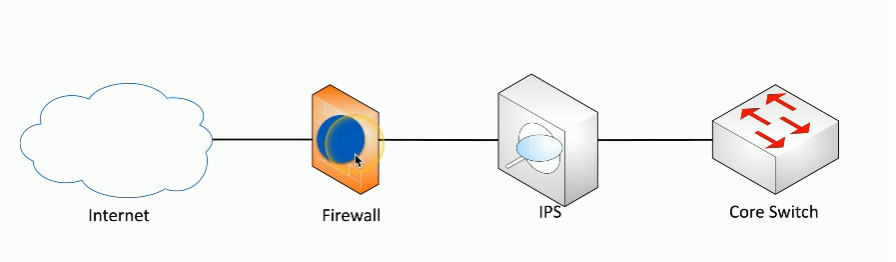
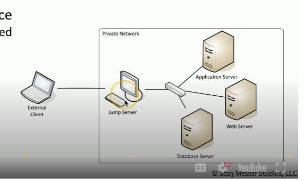

# Cloud Infrastructures
- Responsibility matrix (i.e. AWS Share Responsibility Model)
- Hybrid cloud (i.e. on-premise and cloud servers in combination)-
- Third party companies are used with a user accounts and the cloud provider
- Infrastructure as Code (i.e. CloudFormation or SAM)
- Serverless architecture (i.e. AWS Lambda functions)
- Microservice architecture and APIs (i.e. using AWS services together instead of 1 application doing everything) 

# Network Infrastructure Concepts
- Switches can be physically located in different locations
- Virtual Local Area Networks (VLAN) are separated logically but not physically (i.e. user A uses 1 portion of the device and user B uses a different portion)
- The software defined network separates different planes of a network such the control and data plane. The control plane handles incoming traffic while the data plane controls where to redirect the traffic.

# Other Infrastructure Concepts
- On-premise security
    - Customize your security posture
    - On-site IT team can manage security better
    - Local team maintains uptime and availability
    - Security changes can take time

- Centralized vs decentralized systems
    - Most organizations are physically decentralized (i.e. many locations, cloud providers, OS, etc.)
    - They're difficult to manage and to protect because of many diverse systems
    - Centralized setups are easier to manage but means there is a single point of failure

- Organizations are moving from VMs to containers because container have better security and easier to manage

- <u>Internet of Things (IoT)</u>: physical devices that are integrated with a network (i.e. sensors, Fitbit, etc.)

- <u>Supervisory Control and Data Acquisition</u>: lets technicians sit in a centralized control  room, monitor the status of the pieces of equipment and make changes and modification without having to physically visit every piece of equipment

- <u>Real Time Operating System (RTOS)</u>: OS with a deterministic processing schedule (i.e. braking system in a car)

- <u>Embedded Systems</u>: hardware and software designed for a specific function (i.e. smart watches)

# Infrastructure Considerations
1. Availability
    - Its a factor since you want users to be able to access whatever they whenever they want

2. Resiliency 
    - Will be tested once something happens. Its referred to as mean time to repair

3. Money is 
    - Always a factor to consider. 
    - Installation, maintenance, replacements, or tax implications affect cost.

4. Responsiveness
    - Critical especially for interactive applications

5. Scalability 
    -  Can be tested anytime

6. Ease of deployments
    - Important to consider during the product engineering phase

7. Risk transference
    - Use cybersecurity insurance
    - Could result in legal issues with customers
    - Involves recovering loss data

8. Ease of recovery
    - Make recovery easy as possible

9. Patch availability
    - Make sure there are solutions to any bugs or issues 
    - Keep up to date and make sure patches are working properly 

10. Inability to patch
    - Embedded systems (i.e. HVAc controls, time clocks) do not have patching as an option
    - Its best to think about additional security controls when this happens

11. Power
    - Think of backups (i.e. generators)

12. Compute
    - Use multiple CPUs across multiple cloud for intense tasks and scalability

# Secure Infrastructure
- <u>Security Zone</u>: lets you logically separate devices by use or access type
    - Each area is associated with a zone (i.e. trusted, internal, inside, servers, screened, etc.)
    - Makes it easier to simplify security policies (i.e. trusted to untrusted or untrusted to screened)
    

- <u>Attack surfaces</u>: potential openings an attacker can access a network
    - Anything can be a vulnerability
        - Application code
        - Open ports
        - Human error
    - Minimize the surface by auditing code, blocking ports with firewalls, monitoring traffic in real time

- Connectivity
    - Ensure an attacker does not access the network by
        - Securing network cables
        - Application level encryption
        - Network level encryption

# Intrusion Prevention
- <u>Intrusion Prevention System (IPS)</u>: designed to watch traffic as it traverses the network in real time
    - It can block anything that is considered dangerous quickly (i.e. SQL injection)
    - Intrusion Detection System (IDS) can only detect/alarm/alert while a IPS can block
- Fail open = when a system fails and data continues to flow
- Fail closed = when a system fails and data does not flow

- <u>Active monitoring</u>: system is connected inline
    - Data can be blocked in real time as it passes by
    - Intrusion prevention is commonly active
    

- <u>Passive monitoring</u>: a copy of the network traffic is examined using a tap or port monitor
    - Data cannot be blocked in real time 
    - Intrusion detection is commonly passive
    

# Network Appliances
- <u>Jump server</u>: a device on the inside of a network that is accessible from the outside

- <u>Proxy server</u>: sits in the middle of devices and make request on behalf of the users
    - Useful for caching, URL filtering, content scanning

- Proxies
    - Simplest proxy = NAT
    - Application proxies are the most common since they work with different protocols 

- <u>Proxy server</u>: sits in the middle of devices and make request on behalf of the users
    - Useful for caching, URL filtering, content scanning

- <u>Load Balancers</u>: distributes loads to multiple services
    - For large scale implementations and fault tolerance

- Sensors and collectors
    - They compile information from network devices
    - Sensors are IPS and use firewall logs, authentication logs, web server logs. This data is then sent to collectors. Collectors are proprietary consoles and consolidate the data being logged

 # Port Security
 - <u>Port Security</u>: security of the individual interfaces that are on a switch or connection to a wireless access point
     - Uses Extensible Authentication Protocol (EAP)
     - EAP and 802.1X work together so that you can provide login credentials and have those credentials provide you with access to the network

# FireWall Types
- Firewalls can filter traffic by port number or app (i.e. OSI layer 4 or OSI layer 7)
    - Layer 4 = TCP or UDP ports
    - Layer 7 = Application layer
- Firewalls encrypt traffic
- Firewalls can act as routers

- <u>Unified Threat Management (UTM)</u>: older all-in-one firewall that bundles several security tools into a single device
    - Used as all in one box firewall with antivirus and VPN

- <u>Next Generation Firewalls (NGFW)</u>: modern firewall that combines traditional firewall functions with advanced features like deep packet inspection, intrusion prevention, and application awareness
    - Operate at layer 7

- <u>Web Application Firewall (WAF)</u>: protects web applications by filtering, monitoring, and blocking HTTP/HTTPS traffic

# Secure Communication
- <u>VPN</u>: encrypts all private data and sends it across the internet
    - <u>Concentrator</u>: decrypts/encrypts data

- SSL/TLS VPN
     - Used for remote access
     - Uses protocol 443
     

- <u>Software Defined Networking (SDN WAN)</u>: method to connect to web based applications
    - No need to connect to a central point (i.e. data center) before connecting to the cloud anymore
    

- <u>Secure Access Service Edge (SASE)</u>: secure way to connect to the cloud
    - It replaces the the concentrator for security
    

 #### Selection of effective controls
 1. VPN - use SSL/TLS for user access
    - IPsec tunnels for site to site access
 2. SD-WAN - use to manage network connectivity to the cloud
    - Use SASE for security

 # Data Types and Classifications
- <u>Regulated</u>: 3rd party determines how the data should be protected
- <u>Trade secret</u>: secret formulas used by organizations
- <u>Intellectual property</u>: may be publicly visible
- <u>Legal information</u>: i.e court records and documents
- <u>Financial information</u>: i.e customer financials, payment records, etc.
- Human readable vs non-human readable (i.e. barcodes)
    - CSV, XML, JSON are hybrid of both

    - Sensitive = intellectual property, PII, PHI
    - Confidential = very sensitive and must be approved
    - Public/Unclassified = no restrictions on viewing the data
    - Restricted/Private/Classified = restricted access and may require an NDA
    - Critical = data that should always be available

# States of Data
- <u>Data at rest</u>: data stored on a storage device (i.e. hard drive, SSD, flash drive, etc.)
    - The data does not have to be encrypted in order for it to be called data at rest
    - The whole disk can be encrypted, only the database is encrypted or the files/folder level is encrypted
    - Once encrypted, then permissions can be added

- <u>Data in transit</u>: data being moved cross the network
    - Use firewalls or IPS to secure data in motion
    - Use TLS or IPsec to encrypt the data

- <u>Data in use</u>: data being processed in memory
    - Data is almost always decrypted

- <u>Data sovereignty</u>: when data is located in a country and is subject to the laws of that country

- <u>Geolocation</u>: location details
    - Different ways to determine location (i.e. 802.11, mobile providers, GPS)
    - Can limit administrative tasks unless secure area is used