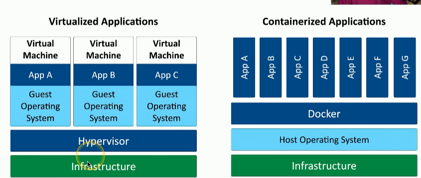
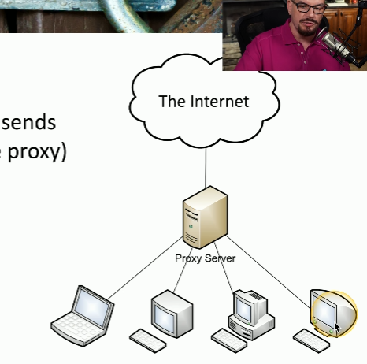
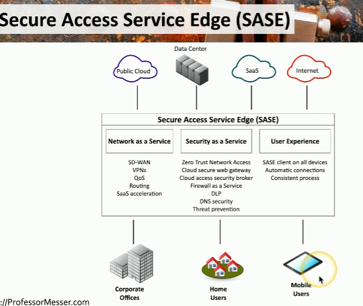

# Cloud Infrastructures
- Responsibility matrix (i.e. AWS Share Responsibility Model)
- Hybrid cloud (i.e. on-premise and cloud servers in combination)
- Third party companies are used with a user accounts and the cloud provider
- Infrastructure as Code (i.e. CloudFormation or SAM)
- Serverless architecture (i.e. AWS Lambda functions)
- Microservice architecture and APIs (i.e. using AWS services together instead of 1 application doing everything) 

# Network Infrastructure Concepts
- <u>Switch</u>: connects devices within the same network and uses MAC addresses to send data only to the right device. It’s like a postal worker who sorts and delivers mail to the correct person in the same building.
    - Can be physically located in different locations
    
- <u>Router</u>: connects different networks and uses IP addresses to decide where data should go. It’s like a postal service , delivering mail between different buildings and choosing the best route to get it to the right place.

- <u>Local Area Network (LAN) </u>: network of devices all connected to each other in the same physical area like a office floor (i.e. An office that has a printer, laptop, phone all connected to a Wifi router)

- <u>Virtual Local Area Networks (VLAN)</u>: a way to split 1 physical LAN into separate, smaller networks using a switch. Devices in different VLANS can't talk to each other unless a router or Layer 3 device allows it.
    - Are separated logically but not physically (i.e. user A uses 1 portion of the device and user B uses a different portion)  
    

- <u>Software-defined Network (SDN)</u>: uses software to control how network devices behave rather than relying on their built in hardware logic.  
    - Can separate different planes of a network such as the control and data plane. The control plane handles incoming traffic while the data plane controls where to redirect the traffic.

# Other Infrastructure Concepts
- On-premise security
    - Customize your security posture
    - On-site IT team can manage security better
    - Local team maintains uptime and availability
    - Security changes can take time

- Centralized vs decentralized systems
    - Most organizations are physically decentralized (i.e. many locations, cloud providers, OS, etc.)
    - They're difficult to manage and to protect because of many diverse systems
    - Centralized setups are easier to manage but means there is a single point of failure

- Organizations are moving from VMs to containers because containers have better security and easier to manage

- <u>Internet of Things (IoT)</u>:physical devices connected to a network that collect or share data and provide useful services, like sensors, smartwatches, or home automation devices. Isolating a device would protect that device in the case of an attack

- <u>Supervisory Control and Data Acquisition (SCADA/ICS)</u>: lets technicians sit in a centralized control room, monitor the status of the pieces of equipment and make changes & modification without having to physically visit every piece of equipment(i.e. power plants, refining, manufacturing equipment)  

- <u>Real Time Operating System (RTOS)</u>: OS designed to process data immediately as it comes in with little delay (i.e. braking system in a car)

- <u>Embedded Systems</u>: a device created to a very specific task within a larger mechanical or electrical system (i.e. smartwatches, medical devices)

# Infrastructure Considerations
1. Availability
    - Its a factor since you want users to be able to access whatever they want whenever they want
    - Ensure only those that need access have it 

2. Resiliency 
    - Will be tested once something happens. Its referred to as mean time to repair

3. Cost
    - Always a factor to consider. 
    - Installation, maintenance, replacements, or tax implications affect cost.

4. Responsiveness
    - Critical especially for interactive applications

5. Scalability 
    -  Can be tested anytime

6. Ease of deployments
    - Important to consider during the product engineering phase

7. Risk transference
    - Use cybersecurity insurance
    - Could result in legal issues with customers
    - Involves recovering loss data

8. Ease of recovery
    - Make recovery easy as possible

9. Patch availability
    - Make sure there are solutions to any bugs or issues 
    - Keep up to date and make sure patches are working properly 

10. Inability to patch
    - Embedded systems (i.e. HVAC controls, time clocks) do not have patching as an option
    - Its best to think about additional security controls when this happens

11. Power
    - Think of backups (i.e. generators)

12. Compute
    - Use multiple CPUs across multiple cloud vendors for intense tasks and scalability

# Secure Infrastructure
- <u>Security Zone</u>: different sections of a network where each section has a different level of security and access rules 
    - Each area is associated with a zone (i.e. trusted, internal, inside, servers, screened, etc.)
    - Makes it easier to simplify security policies (i.e. trusted to untrusted or untrusted to screened)  
    

- <u>Attack surfaces</u>: potential openings an attacker can access a network
    - Anything can be a vulnerability
        - Application code
        - Open ports
        - Human error
    - Minimize the surface by auditing code, blocking ports with firewalls, monitoring traffic in real time

- Connectivity
    - Ensure an attacker does not access the network by
        - Securing network cables
        - Application level encryption
        - Network level encryption

# Intrusion Prevention
- <u>Intrusion Prevention System (IPS)</u>: a security tool that actively monitors network traffic, detects malicious activity, and automatically takes action to block or mitigate threats in real time
    - It can block anything that is considered dangerous quickly (i.e. SQL injection)
    - Intrusion Detection System (IDS) can only detect/alarm/alert while a IPS can block
- Fail open =  scenario where if there is a failure on the network, the system will automatically open or allow access
- Fail closed = scenario where if there is a failure on the network, the system will automatically close or deny access

- <u>Active monitoring</u>: sending test traffic into the network to check performance or availability (i.e. ping test, IPS)  
    - Data can be blocked in real time as it passes by
    - Intrusion prevention is commonly active  
    

- <u>Passive monitoring</u>: watching and analyzing real network traffic without interfering (i.e. IDS)
    - Data cannot be blocked in real time 
    - Intrusion detection is commonly passive  
    

# Network Appliances
- <u>Jump server</u>: a secure computer that you connect to first before accessing other systems inside a network. It helps protect internal systems by acting like a security checkpoint  

- <u>Proxy server</u>: sits in the middle of devices and make request on behalf of the users   
    - Useful for caching, URL filtering, content scanning  

- Proxies
    - Simplest proxy = Network-level proxy (NAT)
    - Application proxies are the most common since they work with different protocols
    - Forward Proxy (Internal Proxy) are proxies that are inside of a users network. The proxy makes the request and returns the results back to the user if all the traffic looks legitimate
        - 

    - A Reverse proxy is a proxy that is part of a internal network but on the server side of the network. Users on the internet connect to the proxy and the proxy connects the user to the web server. The web server and proxy are in a internal network while the user is outside the network
        - It limits the amount of load being sent to the web server since certain requests are cached on the proxy
        - 

    - A open proxy is a proxy controlled by a 3rd party. They are not secure since the owner can ad anything they want as traffic moves like advertisement or malicious code
        - 
    

- <u>Load Balancers</u>: distributes loads to multiple services  
    - For large scale implementations and fault tolerance
    - An active/active load balancer is a configuration where all the servers connected to the load balancer are all being used
        - TCP Offload 
            - It reuses the same protocol connection (i.e. TCP) for each connected server. This means the balancer does not need to create a new connection for each server that is added to it
        - SSL Offload
            - Instead of each server handling the decryption the load balancer can handle it for each server connected
        - Cache
            - Act as a proxy and store commonly requested data
        - Prioritization
            - Determine which data needs to be taken care of first
        - Content switching
            - It means the balancer can recognize certain content and redirect it to the correct server that handles that content
        - 
    
    - An active/passive load balancer is a configuration where some of the servers are working/active while other servers are not or on standby
        - If an active server is no longer working, traffic is redirected to one of the standby servers
        - 

- Sensors and collectors  
    - They compile information from network devices
    - Sensors are IPS and use firewall logs, authentication logs, or web server logs. This data is then sent to collectors. Collectors are proprietary consoles and consolidate the data being logged

# Port Security
 - <u>Port Security</u>: security of the individual interfaces that are on a switch or connection to a wireless access point
     - <u>Extensible Authentication Protocol (EAP)</u>: a framework used for authentication. It supports different authentication methods like passwords, certificates, or tokens and different connection types like wireless or switches. It doesn't do the authentication but instead defines the rules and structure for how messages are authenticated
        - EAP is like a post office, it accepts different types of mail(authentication methods) and delivers them correctly using its established system no matter the type of mail that comes in (wired or wireless)

     - <u>802.1X</u>: port based NAC standard that uses EAP to authenticate users & devices before allowing them on the network  
        - EAP is the framework that supports different authentication methods and devices while 802.1X is the standard that uses EAP to enforce authentication on specific network ports or connections

# FireWall Types
- Firewalls can filter traffic by port number or app
    - Layer 4 = TCP or UDP ports
    - Layer 7 = Application layer
- Firewalls encrypt traffic
- Firewalls can act as routers (Layer 3). They can sit at the ingress/egress of the network

- <u>Unified Threat Management (UTM)</u>: when multiple security features or services are combined into a single device within your network  
    - Used as all in one firewall with antivirus and VPN
    - Its like a basic tool kit, you have a bunch of common tools that you can use for most scenarios if something happens

- <u>Next Generation Firewalls (NGFW)</u>: modern firewall that combines traditional and advanced firewall features like deep packet inspection, intrusion prevention, and application awareness
    - It operates at layer 7
    - Its like a bigger tool box with more tools. You can do more with the tools compared to a UTM

- <u>Web Application Firewall (WAF)</u>: monitors, filters, and blocks malicious traffic to and from web apps based on the expected input
    - Its like a specialized tool box. It has tools specifically for working on a car (web app)

# Secure Communication
- <u>Virtual Private Network (VPN)</u>: encrypts all private data and sends it across the internet
    - <u>VPN Concentrator</u>: device on a hardware device that terminates and  manages connections multiple VPN connections. It handles the encryption and decryption for all the incoming connections.
        - Often integrated with a firewall
        - 

- Secure Socket Layer (SSL)/Transport Layer Security (TLS) VPN
     - Used for remote access involving desktops or workstations
     - Uses tcp/443
     
- 

- <u>Software Defined Networking in a Wide Area Network (SD-WAN)</u>: uses SDN principles to securely and efficiently manage connections between users, applications, and data centers across different locations. It focuses on how efficiently and scalable a system can route a user to their desired destination
    - If using AWS for storing data, a SD-WAN can find the fastest and secure route for the user to access the data
    - No need to connect to a central point (i.e. data center) before connecting to the cloud anymore
    - 
    

- <u>Secure Access Service Edge (SASE)</u>: takes the same approach as SD-WAN and applies it to cloud architecture where networking and security are focused on
    - It replaces the concentrator for security  
    

 #### Selection of effective controls
 1. VPN (remote user access)
    - Uses TLS encryption to protect data
    - Its secure, flexible, and app level access. Its best used for individual remote users 
    - Use case example: employees working from home
 2. IPsec (site to site network link)
    - Works at the Network Layer (Layer 3)
    - Encrypts all IP traffic
    - Used in site to site VPNs 
    - Use case example: connecting a NY office and a LA office
 3. SD-WAN (cloud traffic management)
    - Improves performance and reliability  
    - Use case example: managing traffic between branch offices and cloud apps  
 4. SASE (cloud based security)
    - Protects users and data regardless of location
    - Great for remote work and cloud first environments
    - Security policies are enforced in cloud and on-premises
    - Use case example: employees working remotely from anywhere such as coffee shops, airport, or home

 # Data Types and Classifications
 #### Data Types
- <u>Regulated</u>: a 3rd party determines how the data should be protected
    - Example: Storing credit card information will involve storing it so it complies with the Payment Card Industry Standards

- <u>Trade secret</u>: secret formulas used by organizations

- <u>Intellectual property</u>: may be publicly visible

- <u>Legal information</u>: i.e court records and documents

- <u>Financial information</u>: i.e customer financials, payment records, etc.

- Human readable vs non-human readable (i.e. barcodes)
    - CSV, XML, JSON are hybrid of both

#### Data Classifications
1. Sensitive: intellectual property, PII, or PHI
2. Confidential: very sensitive information where you must be approved before viewing
3. Public: shared with everyone. No security required
4. Restricted: very limited in access. Only available to specific people (i.e. system admin credentials)
5. Private/Classified/Restricted: restricted access and may require an NDA
6. Critical: data that should always be available

# States of Data
- <u>Data at rest</u>: data stored on a storage device (i.e. hard drive, SSD, flash drive, etc.)
    - The data does not have to be encrypted in order for it to be called data at rest
    - Once encrypted, then permissions can be added

- <u>Data in transit</u>: data being moved cross the network
    - Involves data moving through devices like switches, routers, etc.
    - Use firewalls or IPS to secure this data
    - Use TLS or IPsec to encrypt the data

- <u>Data in use</u>: data in memory of a system or actively being processed
    - Data is almost always decrypted

- <u>Data sovereignty</u>: when data is located in a country and is subject to the laws of that country

- <u>Geolocation</u>: location details
    - Different ways to determine location (i.e. 802.11, mobile providers, GPS)
    - Can limit administrative tasks unless secure area is used

# Protecting Data
- <u>Geographic restrictions</u>: protecting data by making policies on where the data is located and where you are as a user
     - <u>Geofencing</u>: automatically allow or restrict access when the user is in a particular location

- Encrypting data means encoding information into unreadable data
    - Original form = plaintext
    - Encrypted form = ciphertext
    - <u>Confusion</u>: encrypted data that is drastically different than the plaintext

 1. Hashing
    - You can not recreate the original data using the hash just like how you can not recreate a person using only their fingerprint
    - Hashing a document and comparing it with the hash that came with the document allows you to verify if the document was tampered with

 2. Obfuscation
    - Means making something normally understandable very difficult to understand
    - The obfuscated code is given to someone while the developer keeps the non-obfuscated code. Both still worked the same
 
 3. Masking
    - Its a type of obfuscation where it takes the original data and hides some of it

 4. Tokenization
    - Replaces sensitive data with non-sensitive placeholders

 5. <u>Segmentation</u>: separate data in smaller pieces and different locations

 6. Permission restrictions
    - When granting access to a user, there are certain rights and permissions associated with the account

# Resiliency
 - Redundancy doesn't always means always available
 - High availability almost always means higher costs
 
 - <u>Server clustering</u>: multiple servers configured to all work together as one big server. The users never see the configuration, they just see one server cluster
    - Is good for capacity and scalability by adding and removing servers as needed
        
    
 - <u>Load balancing</u>: distributes load across all of the individual multiple devices
    - Distributes load across multiple devices
        

    - Load Balancing vs Server Clustering
        - In load balancing, each of the servers have no idea that the other server even exists
        - Server clustering involves sharing resources
        - Server Clustering provides better redundancy than Load balancing since the servers are grouped together
        - Load Balancing provides increase availability, better performance, and scalability while Server clustering provides high availability, fault tolerance and scalability
        - They're similar in that you can add and remove devices from both
  
 - <u>Site resiliency</u>: recovery site is prepped and ready if something happens to the primary data site
 - <u>Hot</u>: fully functional real time replica of the primary environment
 - <u>Cold</u>: an empty building with basic infrastructure like power, cooling, and network connectivity
 - <u>Warm</u>: big room with rack space where you bring the hardware
 - <u>Geographic dispersion</u>: data center or recovery sites located at a sufficient different distance from the primary site 

 - <u>Platform diversity</u>: using different OS' across a system to reduce attacks on the same vulnerability (having the same OS everywhere could mean they have the same vulnerability) 

 - <u>Multi-cloud</u>: use different cloud providers

 - <u>Continuity Of Operations Planning (COOP)</u>: the plan set in place if there is a disruption. It outlines essential functions and services that will be maintained during and after the disruption to ensure operations continue as normally (i.e. the procedures to use hard copies)

# Capacity Planning
- Try your best to match supply to demand
- People
    - Too few people means you need to consider hiring more. Too little and you might need to redeploy to other parts of the organization or downsize 
- Technology
    - Use technologies that can scale
- Infrastructure
    - Need to decide what virtual and physical devices need to be used

# Recovery Testing
- <u>Table top exercise</u>: discussion based scenario session where a team discusses their roles and responds during an emergency. The team walks through one or more example scenarios.

- <u>Fail over test</u>: test to see if redundancy setup works if there is a system failure  

- <u>Simulation</u>: test with a simulated event
    - Examples: Phishing attacks, password requests, data breaches

- <u>Parallel processing</u>: split a process through multiple parallel CPUs

# Backups
- <u>Onsite/offsite</u>: 
    - Onsite 
        - Data and backups are at the same location 
    - Offsite
        - Data needs to be transferred over the internet somewhere else
    - Organizations can use both, onsite for short term and offsite for long term 

- <u>Frequency</u>: need to determine how often data needs to backed up 
    - Depends on the different systems involved
    - May have multiple backup sets
    - Lots of planning is involved

- Encryption

- <u>Snapshot</u>: instant backup of an entire system and current configurations of the data 
    - Commonly used with virtual machines
    - Common practice to take daily snapshots of a VM

- <u>Recovery</u>: verify the backups can be restored and used
    
- <u>Replication</u>: copy data to one or multiple locations simultaneously
    - The replicas/backups are updated in real time whenever the original data is updated

- <u>Journaling</u>: writing data to a temporary journal located on a drive before writing to the database. If power is lost, the system can recover all of or the needed data from the journal
    - Its helps against the issue when writing to a database and there is an outage causing the data in the database to be corrupted

# Power Resiliency
- <u>Uninterruptible Power Supply (UPS)</u>: short term power source
    - Offline/Standby UPS =  normally runs on main power but if power fails, an internal switch quickly transfers the load to the backup battery
    - Line-interactive UPS = slowly increases voltage if there is a drop in main line power
    - On-line/double-conversion UPS = used for always using battery backup
    - Generators are used for long term power