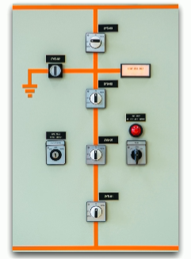
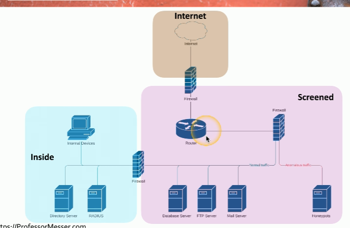
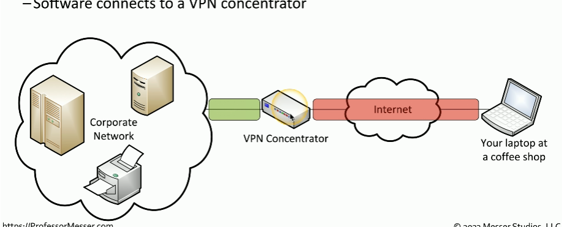
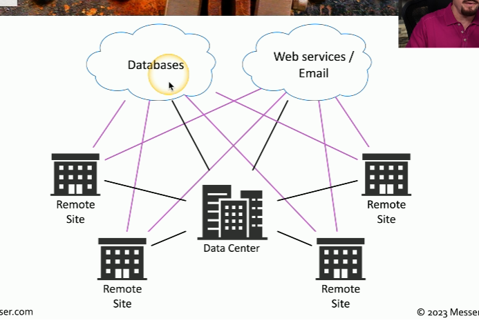
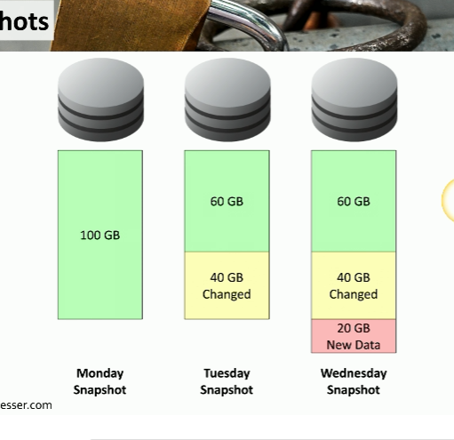

# Cloud Infrastructures
- Responsibility matrix (i.e. AWS Share Responsibility Model)
- Hybrid cloud (i.e. on-premise and cloud servers in combination)
- Third party companies are used with a user accounts and the cloud provider
- Infrastructure as Code (i.e. CloudFormation or SAM)
- Serverless architecture (i.e. AWS Lambda functions)
- Microservice architecture and APIs (i.e. using AWS services together instead of 1 application doing everything) 

# Network Infrastructure Concepts
- <u>Switch</u>: connects devices within the same network and uses MAC addresses to send data only to the right device. It’s like a postal worker who sorts and delivers mail to the correct person in the same building.
    - Can be physically located in different locations
- <u>Router</u>: connects different networks and uses IP addresses to decide where data should go. It’s like a postal service , delivering mail between different buildings and choosing the best route to get it to the right place.
- <u>Local Area Network (LAN) </u>: network of devices all connected to each other in the same physical area like a office floor (i.e. An office that has a printer, laptop, phone all connected to a Wifi router)
- <u>Virtual Local Area Networks (VLAN)</u>: a way to split 1 physical LAN into separate, smaller networks using a switch. Devices in different VLANS can't talk to each other unless a router or Layer 3 device allows it.
    - Are separated logically but not physically (i.e. user A uses 1 portion of the device and user B uses a different portion)  
- <u>Software-defined Network (SDN)</u>: uses software to control how network devices behave rather than relying on their built in hardware logic.  
    - Can separate different planes of a network such as the control and data plane. The control plane handles incoming traffic while the data plane controls where to redirect the traffic.

# Other Infrastructure Concepts
- On-premise security
    - Customize your security posture
    - On-site IT team can manage security better
    - Local team maintains uptime and availability
    - Security changes can take time

- Centralized vs decentralized systems
    - Most organizations are physically decentralized (i.e. many locations, cloud providers, OS, etc.)
    - They're difficult to manage and to protect because of many diverse systems
    - Centralized setups are easier to manage but means there is a single point of failure

- Organizations are moving from VMs to containers because containers have better security and easier to manage

- <u>Internet of Things (IoT)</u>: physical devices that are integrated with a network (i.e. sensors, Fitbit, etc.)

- <u>Supervisory Control and Data Acquisition</u>: lets technicians sit in a centralized control  room, monitor the status of the pieces of equipment and make changes and modification without having to physically visit every piece of equipment  

- <u>Real Time Operating System (RTOS)</u>: OS designed to process data immediately as it comes in with little delay (i.e. braking system in a car)

- <u>Embedded Systems</u>: A device created to a very specific task within a larger mechanical or electrical system (i.e. smartwatches, medical devices)

# Infrastructure Considerations
1. Availability
    - Its a factor since you want users to be able to access whatever they want whenever they want

2. Resiliency 
    - Will be tested once something happens. Its referred to as mean time to repair

3. Cost
    - Always a factor to consider. 
    - Installation, maintenance, replacements, or tax implications affect cost.

4. Responsiveness
    - Critical especially for interactive applications

5. Scalability 
    -  Can be tested anytime

6. Ease of deployments
    - Important to consider during the product engineering phase

7. Risk transference
    - Use cybersecurity insurance
    - Could result in legal issues with customers
    - Involves recovering loss data

8. Ease of recovery
    - Make recovery easy as possible

9. Patch availability
    - Make sure there are solutions to any bugs or issues 
    - Keep up to date and make sure patches are working properly 

10. Inability to patch
    - Embedded systems (i.e. HVAC controls, time clocks) do not have patching as an option
    - Its best to think about additional security controls when this happens

11. Power
    - Think of backups (i.e. generators)

12. Compute
    - Use multiple CPUs across multiple cloud vendors for intense tasks and scalability

# Secure Infrastructure
- <u>Security Zone</u>: lets you logically separate devices by use or access type
    - Each area is associated with a zone (i.e. trusted, internal, inside, servers, screened, etc.)
    - Makes it easier to simplify security policies (i.e. trusted to untrusted or untrusted to screened)  
    

- <u>Attack surfaces</u>: potential openings an attacker can access a network
    - Anything can be a vulnerability
        - Application code
        - Open ports
        - Human error
    - Minimize the surface by auditing code, blocking ports with firewalls, monitoring traffic in real time

- Connectivity
    - Ensure an attacker does not access the network by
        - Securing network cables
        - Application level encryption
        - Network level encryption

# Intrusion Prevention
- <u>Intrusion Prevention System (IPS)</u>: a security tool that actively monitors network traffic, detects malicious activity, and automatically takes action to block or mitigate threats in real time
    - It can block anything that is considered dangerous quickly (i.e. SQL injection)
    - Intrusion Detection System (IDS) can only detect/alarm/alert while a IPS can block
- Fail open =  scenario where if there is a failure on the network, the system will automatically open or allow access
- Fail closed = scenario where if there is a failure on the network, the system will automatically close or deny access

- <u>Active monitoring</u>: sending test traffic into the network to check performance or availability (i.e. ping test, IPS)  
    - Data can be blocked in real time as it passes by
    - Intrusion prevention is commonly active  
    

- <u>Passive monitoring</u>: watching and analyzing real network traffic without interfering (i.e. IDS)
    - Data cannot be blocked in real time 
    - Intrusion detection is commonly passive  
    

# Network Appliances
- <u>Jump server</u>: a secure computer that you connect to first before accessing other systems inside a network. It helps protect internal systems by acting like a security checkpoint  

- <u>Proxy server</u>: sits in the middle of devices and make request on behalf of the users   
    - Useful for caching, URL filtering, content scanning  

- Proxies
    - Simplest proxy = NAT
    - Application proxies are the most common since they work with different protocols  

- <u>Load Balancers</u>: distributes loads to multiple services  
    - For large scale implementations and fault tolerance

- Sensors and collectors  
    - They compile information from network devices
    - Sensors are IPS and use firewall logs, authentication logs, web server logs. This data is then sent to collectors. Collectors are proprietary consoles and consolidate the data being logged

 # Port Security
 - <u>Port Security</u>: security of the individual interfaces that are on a switch or connection to a wireless access point
     - <u>Extensible Authentication Protocol (EAP)</u>: a framework used for authentication. It allows different methods of verifying a user's identity over a network.
     - <u>802.1X</u>: port based network access control system that uses EAP to authenticate users before allowing them on the network  
        - EAP and 802.1X work together so that you can provide login credentials and have those credentials provide you with access to the network

# FireWall Types
- Firewalls can filter traffic by port number or app (i.e. OSI layer 4 or OSI layer 7)
    - Layer 4 = TCP or UDP ports
    - Layer 7 = Application layer
- Firewalls encrypt traffic
- Firewalls can act as routers

- <u>Unified Threat Management (UTM)</u>: When multiple security features or services are combined into a single device within your network  
    - Used as all in one firewall with antivirus and VPN

- <u>Next Generation Firewalls (NGFW)</u>: modern firewall that combines traditional firewall functions with advanced features like deep packet inspection, intrusion prevention, and application awareness
    - Operates at layer 7

- <u>Web Application Firewall (WAF)</u>: monitors, filters, and blocks malicious traffic to and from web apps

# Secure Communication
- <u>Virtual Private Network (VPN)</u>: encrypts all private data and sends it across the internet
    - <u>Concentrator</u>: decrypts/encrypts data

- SSL/TLS VPN
     - Used for remote access
     - Uses protocol 443  
     

- <u>Software Defined Networking (SD-WAN)</u>: uses SDN principles to securely and efficiently manage connections between different physical locations. It involves integrating additional security services or device to enhance a network's defenses such as using a 3rd party cloud based service or specialized security device that works with the current SD-WAN technology  
    - No need to connect to a central point (i.e. data center) before connecting to the cloud anymore  
    

- <u>Secure Access Service Edge (SASE)</u>: combines network security and WAN capabilities in a cloud-based service
    - It replaces the the concentrator for security  
    

 #### Selection of effective controls
 1. VPN (remote user access)
    - Uses TLS encryption to protect data
    - Its secure, flexible, and app level access. Its best used for individual remote users 
    - Use case example: employees working from home
 2. IPsec (site to site network link)
    - Works at the Network Layer (Layer 3)
    - Encrypts all IP traffic
    - Used in site to site VPNs 
    - Use case example: connecting a NY office and a LA office
 3. SD-WAN (cloud traffic management)
    - Improves performance and reliability  
    - Use case example: managing traffic between branch offices and cloud apps  
 4. SASE (cloud based security)
    - Protects users and data regardless of location
    - Great for remote work and cloud first environments
    - Security policies are enforced in cloud and on-premises
    - Use case example: employees working remotely from anywhere such as coffee shops, airport, or home

 # Data Types and Classifications
- <u>Regulated</u>: 3rd party determines how the data should be protected
- <u>Trade secret</u>: secret formulas used by organizations
- <u>Intellectual property</u>: may be publicly visible
- <u>Legal information</u>: i.e court records and documents
- <u>Financial information</u>: i.e customer financials, payment records, etc.

- Human readable vs non-human readable (i.e. barcodes)
    - CSV, XML, JSON are hybrid of both

1. Sensitive: should not be publicly exposed but not the most important (i.e. employee schedules, internal company memos)
2. Confidential: specific to a group and could cause serious damage if exposed (i.e. customer data, employee records)
3. Public: shared with everyone. No security required
4. Restricted: very limited in access. Only available to specific people (i.e. system admin credentials)
5. Private: PII and leaking it could result in privacy violations or identity theft (i.e. medical records, SSN)
6. Critical: losing the data or access to the data will have severe impact (i.e. payment processing systems)

# States of Data
- <u>Data at rest</u>: data stored on a storage device (i.e. hard drive, SSD, flash drive, etc.)
    - The data does not have to be encrypted in order for it to be called data at rest
    - The whole disk can be encrypted, only the database is encrypted or the files/folder level is encrypted
    - Once encrypted, then permissions can be added

- <u>Data in transit</u>: data being moved cross the network
    - Use firewalls or IPS to secure data in motion
    - Use TLS or IPsec to encrypt the data

- <u>Data in use</u>: data being processed in memory
    - Data is almost always decrypted

- <u>Data sovereignty</u>: when data is located in a country and is subject to the laws of that country

- <u>Geolocation</u>: location details
    - Different ways to determine location (i.e. 802.11, mobile providers, GPS)
    - Can limit administrative tasks unless secure area is used

 # Protecting Data
 1. <u>Geographic restrictions</u>: protecting data by making policies on where the data is located and where you are as a user
     - <u>Geofencing</u>: automatically allow or restrict access when the user is in a particular location

 2. Encrypting data means encoding information into unreadable data
    - Original form = plaintext
    - Encrypted form = ciphertext
    - <u>Confusion</u>: encrypted data that is drastically different than the plaintext

 3. Hashing
    - Hashing + digital signature means you can authenticate, non-repudiation, and have integrity 

 4. Obfuscation
 
 5. Masking (a type of obfuscation)

 6. Tokenization

 7. <u>Segmentation</u>: separate data in smaller pieces and different locations

  8. Permission restrictions

  # Resiliency
  - Redundancy doesn't always means always available
  - High availability almost always means higher costs

    - <u>Server clustering</u>: multiple servers configured to all work together as one big server. The users never see the configuration, they just see one server cluster
        
    
    - <u>Load balancing</u>: distributes load across all of the individual multiple devices

        - Load Balancing vs Server Clustering
            - In load balancing, each of the servers have no idea that the other server even exists
            - Server clustering involves sharing resources
            - Server Clustering provides better redundancy than Load balancing since the servers are grouped together
            - Load Balancing provides increase availability, better performance, and scalability while Server clustering provides high availability, fault tolerance and scalability
            - They're similar in that you can add and remove devices from both
  
  - <u>Site resiliency</u>: recovery site is prepped and ready if something happens to the primary data site
    - <u>Hot</u>: fully functional real time replica of the primary environment
    - <u>Cold</u>: an empty building with basic infrastructure like power, cooling, and network connectivity
    - <u>Warm</u>: big room with rack space where you bring the hardware
    - <u>Geographic dispersion</u>: data center or recovery sites located at a sufficient different distance from the primary site 

    - <u>Platform diversity</u>: using different OS' across a system to reduce attacks on the same vulnerability (having the same OS everywhere could mean they have the same vulnerability) 

    - <u>Multi-cloud</u>: use different cloud providers

    - <u>Continuity Of Operations Planning (COOP)</u>: the plan set in place if there is a disruption. It outlines essential functions and services that will be maintained during and after the disruption to ensure operations continue as normally (i.e. the procedures to use hard copies)

# Capacity Planning
- Try your best to match supply to demand
- People
    - Too few people means you need to consider hiring more. Too little and you might need to redeploy to other parts of the organization or downsize 
- Technology
    - Use technologies that can scale
- Infrastructure
    - Need to decide what virtual and physical devices need to be used

# Recovery Testing
- <u>Table top exercise</u>: go through steps as if you were actually going through them

- <u>Fail over test</u>: test if redundancy works  

- <u>Simulation</u>: test with a simulated event

- <u>Parallel processing</u>: split a process through multiple parallel CPUs

# Backups
- <u>Onsite/offsite</u>: 
    - Onsite 
        - Data and backups are at the same location 
    - Offsite,
        - Data needs to be transferred over the internet somewhere else
    - Organizations can use both, onsite for short term and offsite for long term 

- <u>Frequency</u>: need to determine how often data needs to backed up 
    - Depends on the different systems involved
    - May have multiple backup sets
    - Lots of planning is involved

- Encryption

- <u>Snapshots (VM)</u>: instant backup of an entire system  

- <u>Recovery</u>: verify the backups can be restored and used
    
- <u>Replication</u>: copy data to one or multiple locations at the same time
    - The replicas are updated as the primary data is updated

- <u>Journaling</u>: writing data to a temporary journal, located on a drive, before writing to the database. If power is lost, the system can recover the last transaction
    - Helps against power outages when updating/working on the data

# Power Resiliency
- <u>Uninterruptible Power Supply (UPS)</u>: short term power source
    - Offline/Standby UPS =  normally runs on main power but if power fails, an internal switch quickly transfers the load to the backup battery
    - Line-interactive UPS = slowly increases voltage if there is a drop in main line power
    - On-line/double-conversion UPS = used for always using battery backup
    - Generators are used for long term power