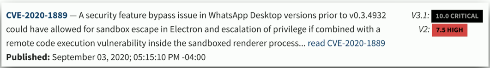
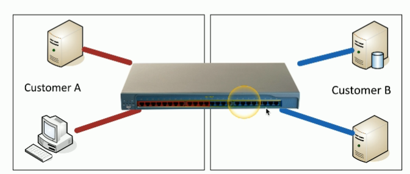
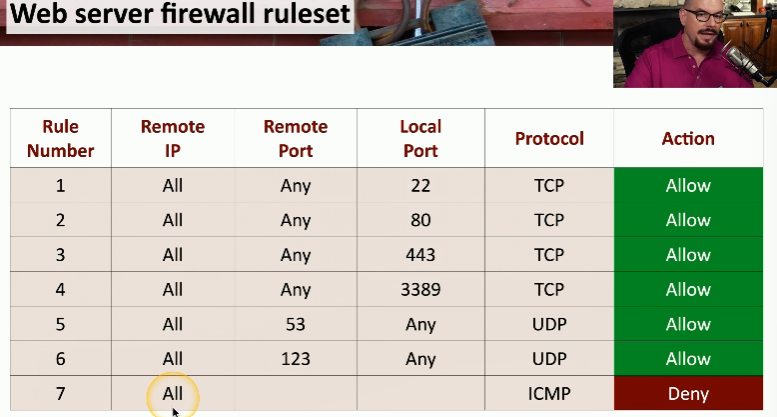
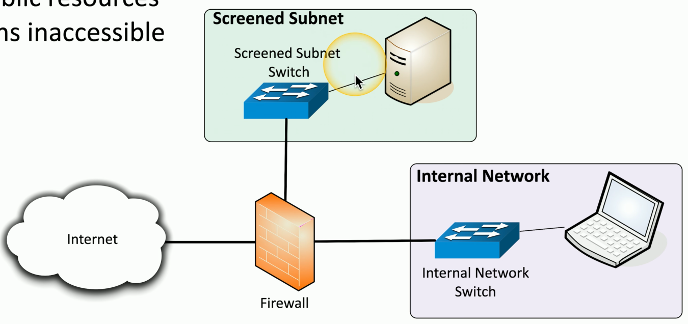
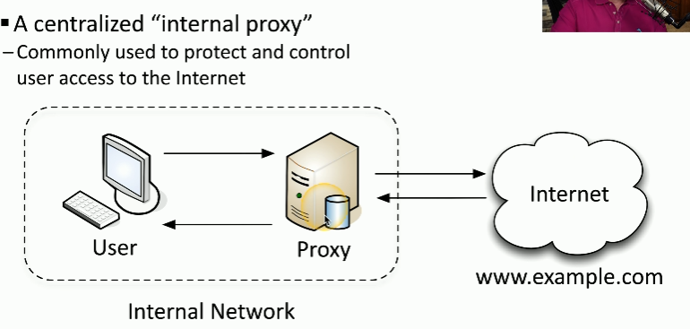
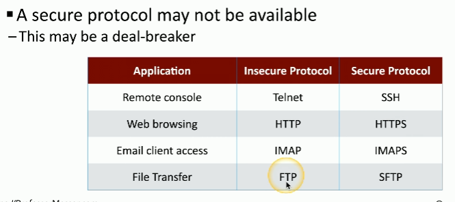

# Secure Baselines
<u>Security Baselines</u>: minimum security configurations and settings established to protect an organizations systems &  assets

- Establish
    - Need to create the baselines. They can be found from manufacturers 
- Deploy
    - Need to put the baselines into action
- Maintain
    - Update the baselines when needed (i.e. updates, new OS, vulnerabilities)

# Hardening Targets
<u>Hardening</u>: securing a system by reducing the the number of weak points/openings an attacker can leverage 

- Mobile devices
    - Hardening checklists are available from manufacturers 
    - Updates are critical for bugs and security patches
    - Segmentation can protect data. The company and user data are usually separated
    - Mobile devices can be managed through a Mobile Device Manager (MDM)

- Workstations
    - Automate monthly patches
    - Remove unnecessary software from the device to reduce the chance of a attack (less options = less vulnerabilities)

- Network infrastructure devices
    - Includes switches, routers, etc.
    - Always change the default credentials
    - Check with manufacturer for any security updates as they are the only ones who will know

- Cloud infrastructure
    - Use least privilege 
    - Configure endpoint detection and response (EDR) to make sure that all devices accessing the cloud are secure
    - Always have backups

- Servers
    - Keep servers updated (i.e. system updates, service packs, security patches)
    - Follow good practices like complex passwords and minimum password lengths
    - Limit access each account has using least privilege and disable unused accounts
    - Limit network access
    - Monitor and secure using anti-virus/anti-malware

- ICS/SCADA
    - Its a combination of using the network and platforms that manage, monitor, and control industrial equipment
    - Are isolated from the rest of the system

- Embedded systems
    - Perform security patches 
    - Segment them and use firewalls

- RTOS
    - Isolate the system from the rest of the network
    - Run these systems with the MINIMUM amount of services (prevents the potential of an exploit)
    - Use secure communication by leveraging host based firewalls

- IoT devices
    - Perform updates ASAP
    - Segment from other devices on a network (limits access to an attacker)

# Securing Wireless and Mobile
- Site surveys
    - Determine existing wireless landscapes
    - Identify existing access points
    - Layout and plan for interference
    - Perform the site survey often since things change all the time

- Heat maps
    - Good way to visualize wireless signal strength

#### Mobile
- System admins can control devices by using a mobile device management (MDM) since its a centralized way to view all devices in a organization
    -  Lets admin do stuff like lock an item after a certain amount of time, require a PIN to be used to sign in, separate information in the device, have the camera turned off all the time, etc.

- <u>Bring your own device (BYOD)</u>: use personal device for personal use and work
    - Difficult to manage since you have to manage personal info and company info

- Corporate-owned, personally
enabled (COPE)
    - Works similar to a BYOD except the organization buys the device for the employee
    - Information is protected using corporate policies 
    - Choose your own device (CYOD) lets a employee decide what device they want to use

- Cellular networks
    - Can be used to monitor traffic or location across the world

- Wi-Fi
    - Susceptible to on-path attacks and DOS attacks

- Bluetooth
    - Susceptible to attacks like WIFI and cellular networks. Be careful of connecting to anything public since anyone can also connect and exploit your device

# Wireless Security Settings
- <u>Wi-Fi Protected Access 3 (WPA3)</u>: newest security standard that keeps your Wifi connection safe
    - Galois/Counter Mode Protocol (GCMP) block cipher code is a stronger encryption than the one used on WPA2
        - Includes data confidentiality feature using AES, Message Integrity Check (MIC), and Galois Message Authentication Code (GMAC)
    - <u>Simultaneous Authentication of Equals (SAE)</u>: new more secure password key exchange that replaced the Pre-Shared Key (PSK) system used in WPA2. With this new system, everyone uses a different session key even with the same PSK

- <u>AAA/Remote Authentication</u>: framework used to determine how access to computers works
    - A = Authentication
    - A = Authorization
    - A = Accounting

- <u>IEEE 802.1X</u>: port based network access control (NAC)
    - You don't get access to the network until you authenticate
    - Uses EAP

- <u>Remote Authentication Dial-In User Service (RADIUS)</u>: authentication protocol that uses the AAA framework
    - Common AAA protocol
    - Used not only for dial ins

# Application Security
- <u>Input validation</u>: verifies that anything not expected in the input will not be interpreted by the app  
    - Example: An input that expects a zip code can check that only numbers and a certain amount of numbers are allowed

- <u>Cookies</u>: information stored on your computer by the browser
    - Used for tracking, personalization, session management
    - Sensitive information should not be saved in a cookie
    - Secure cookies will be sent over HTTPS

- <u>Static code analysis</u>: automatically scanning an application's source code for vulnerabilities before its executed
    - Static Application Security Testing (SAST) is the processing of finding these vulnerabilities

- <u>Code signing</u>: digitally signing software to verify its authenticity and integrity to make sure it has not been tampered with

- <u>Sandboxing</u>: the practice of isolating an environment when working with potentially malicious software to prevent the primary system from being affected
    - Commonly used during development 
    - The application can not access unrelated resources
    - "Play in their own sandbox"

- You can monitor your application in real time
    - View blocked attacks
    - Audit logs to get more information
    - Anomaly detection (i.e. unusual file transfers, increase in client access)

# Asset Management
- <u>Acquisition/procurement process</u>: purchasing goods and services from third parties

- Assignment/accounting
    - A central asset tracking system tracks all the products received 
    - Ownership
        - First step in a tracking system
        - Associate with a person
    - Classification
        - Type of asset
        - Hardware
        - Software

- Monitoring/asset tracking
    - Helps the helpdesk for tracking of devices
    - Inventory (i.e. laptops, desktops, servers, etc.)
    - Enumeration
        - When referring to monitoring/asset tracking, it means listing and labeling each asset (i.e. hardware, software, or data) so it can be tracked, managed and secured properly

- Sanitization
    - Remove all data. It wont be used again.
    - There are different use cases (i.e. clean a hard drive for future use, permanently delete a single file)
    - If data is completely removed, the device can be used by someone else without worrying if the new user can access the old data

- Destruction
    - Physically destroy hardware

- Certification
    - Destruction of hardware by a third party. There is a confirmation that the hardware is destroyed.
    - Used when a organization does not have time to destroy the hardware themselves

- Data retention
    - Backup data
    - Follow compliance (i.e. certain amounts of data need to be kept)
    - Different data types have different procedures

# Vulnerability Scanning
- Vulnerability scans only check what potential vulnerabilities there are like a port scan
    - Not all scans are accurate. Need to review reports to view what is accurate and whats not
    - The scans are mostly associated with those outside of the network trying to gain access but scanning inside the network is also needed. An attack from the inside is also very possible.

- Static analysis
    - Scans for multiple vulnerabilities to help identify security flaws
        - Involves using Static Application Security Testing (SAST) software
    - The vulnerabilities are found easily
    - Not everything can be identified through analysis (i.e. authentication, security, insecure cryptography, etc.)
    - Requires verification of each finding to avoid false-positives

- <u>Dynamic analysis (Fuzzing)</u>: sends random input to an application in order to see what the output might be (aka fault injecting, robustness testing, syntax testing, negative testing)
    - Looking for something out if the ordinary to occur (i.e. application crash, server error, exception)

- Package monitoring
    - Some applications are distributed in a package. You need to confirm the package is legitimate
        - Trust the source
        - No added malware
        - No embedded vulnerabilities
    - Confirm package is safe before deploying

# Threat Intelligence
- <u>Open-source intelligence (OSINT)</u>: method of gathering and analyzing publicly available information to help inform decisions
    - Use discussion groups or anything public including the government
    - Commercial data like maps, financials are also usable

- Proprietary/third-party
    - 3rd party organizations who analyze threats across multiple organizations simultaneously. They will provide this information to you for a fee.

- Information-sharing organization
    - Can be private or public organizations
    - The data is shared for critical security details about threats (i.e. Cyber Threat Alliance)
        - Information is uploaded and members can use the information whenever they need it

- Dark web
    - The attacker themselves and the information they've successfully stolen

# Penetration Testing
- <u>Penetration Testing</u>: simulate an attack on your own system
    - Rules of engagement define purpose and scope of the test. Basically it determines what is allowed to be tested and when
    - Once in the system, the goal should be too move across systems (horizontally)
    - Make sure you have a way back into the system (i.e. a back door)
    - Leverage current compromised systems to access others as stepping stones

# Analyzing Vulnerabilities
- <u>False positive</u>: vulnerability that is detected but doesn't really exist
- <u>False negative</u>: vulnerability that does exist but wasn't detected
    - Update signatures to prevent false positives or negatives

- Prioritize
    - Refer to public disclosures when deciding how to categorize vulnerabilities from least important to most important

- <u>Common Vulnerability Scoring System (CVSS)</u>: rating system used to categorize vulnerabilities on a level of how big of a threat they are

- <u>Common Vulnerability Enumeration (CVE)</u>: list of vulnerabilities and how important they are

- Vulnerability classification
    - Scanning most parts of a system but not everything. 
    - The signatures are the key since they have information related to the latest vulnerabilities
        - Example: 
    
- <u>Exposure Factor (EF)</u>: determines how much damage an asset would take if a known vulnerability is leveraged

- Environmental variables
    - If a system is isolated it might not be a priority. If its on the public cloud that's used by many users, it could be the number one priority. The environment a system is a part of determines how important it is.

- Industry/organizational impact
    - Who is affected by it should an attack happen. Some attacks have bigger affects on others

- Risk tolerance
    - An organization's willingness to accept the potential negative impact of risks, even after mitigation efforts have been applied

# Vulnerability Remediation
- Patching
    - Most common mitigation technique
    - Used when a known vulnerability exists and have the patch file to install
    - Schedule vulnerability/patches

- Insurance
    - Cybersecurity insurance occurs after an attack. It helps to get lost money &  data to prevent lawsuits
    - It doesn't cover everything
    - Ransomware is an example of where insurance is used

- Segmentation
    - Limit access by separating devices to their own networks/VLANs. It will limit the attacker to that segment part of the network keeping other areas of the network safe.
        - Red customers can only communicate to red customers and same thing for blue  
        - Can not communicate between VLANs w/o a Layer 3 device/router
        
    - Patching isn't always possible
    - Use internal NGFW

- Compensating controls
    - Makeup for security if patching isn't possible like:
        - Disable the problematic service
        - Revoke access to the application
        - Limit external access
        - Modify internal security controls and software firewalls

- Exceptions and exemptions
    - Some vulnerabilities can't be patched so they will not be taken care of. The severity of these vulnerabilities may not be high so they can be left alone (i.e. a vulnerability that requires physical access)

- Validation of remediations
    - Rescan, Audit, and verify the patches/solutions worked

- Reporting
    - Ongoing checks of the system to discover new threats

# Security Monitoring 
- Computing resources 
    - Systems
        - Authentication from strange places and servers (i.e. backups, software versions, activity)
        - Solutions: Server monitoring like service activity, backups, or software versions
    - Applications
        - Ensure availability and data transfers are working properly
    - Infrastructure
        - Remote access systems and firewalls

- Log aggregation
    - <u>Security Information and Event Manager (SIEM)</u>: consolidates and analyzes data from different sources to a central database. It helps with detecting threats, responding to incidents, and meeting compliance requirements
        - Centralized reporting
        - View how information between systems is related (i.e. view authentication and access)

- Scanning

- Reporting
    - Analyze the collected data to determine what to do next
    - Provides status information
    - Ad hoc information summaries for hypothetical situations

- Archiving
    - May be mandated by law to hold onto certain information

- Alert response and remediation/validation
    - Keeps the right people informed
    - Help enable quick response and status information 
    -  Quarantine
        - Isolate the system from the rest of the network to prevent further attacks
    - Alert tuning
        - Make sure alerts are working properly and prevent false negatives

# Security Tools
- <u>Security Content Automation Protocol (SCAP)</u>: specifications developed by NIST to standardize the way security software communicates information about vulnerabilities, configurations, and compliance
    - Maintained by NIST
    - Validates the security configuration
    - Confirm patch installs
    - Scan for a security breach
    - Useful in large environments 

- <u>Benchmarks</u>: applying security best practices to everything
    - For a mobile device, good benchmarks would be to disable screenshots, disable screen recordings, prevent voice calls when locked

- Agents/agentless
    - <u>Agent Based Solution</u>: specialized software installed directly onto a device (i.e. endpoint, server, or VM) in order to perform security related tasks and report data (i.e. antivirus, endpoint detection)
        - Agents can check if a device is compliant and provide additional details
        - Best used for real time security, in depth monitoring, and proactive actions
        - It checks the system is working properly but it needs to be maintained
    - <u>Agentless Solution</u>: no software is installed. The monitoring system connects to the device or cloud service (via APIs, SNMP or cloud provider) to gather usage and security data
        - Best used for simple and broad visibility of a system

- Security information and event management (SIEM)
    - Collects security alerts
    - Can be used for forensic analysis 

- Antivirus
    - Malware refers to the broad malicious software category
    - Anti-virus and anti-malware are now the same thing

- <u>Data loss prevention (DLP)</u>: set of tools and processes used to ensure that sensitive data is not lost, misused, or accessed by unauthorized users
    - Stop the data before the attacker gets it
    - Can stop information like SSN, credit cart numbers and medical records from being leaked
    - Monitors in real time

- Simple Network Management Protocol (SNMP) traps
    - <u>SNMP</u>: protocol used for collecting and organizing information about devices (i.e. printers, routers, etc.) over the network and can modify how the devices behave using that information
    - Used for monitoring and managing devices
    - Can be leveraged to request statistics from a device
    - Poll devices at fixed intervals
    - "How is the device itself doing?"

- <u>NetFlow</u>: protocol used for collecting IP traffic and monitoring traffic on a network
    - Used to get a picture of network traffic flow and volume
    - Shared communication between devices
    - "Whats happening through the device in terms of traffic?"

- Vulnerability scanners
    - Can check if there are potential vulnerabilities
    - Gather as much helpful information as possible

# Firewalls
- <u>Firewall</u>: appliance that sits inline in your network and makes decisions about whether traffic should be allowed or disallowed through the firewall
    - Most firewalls can be on layer 3 devices (routers)

- Ports/protocols
    - Helps make forwarding decisions based on protocol and port numbers
        - web server = tcp/80 or tcp/443
        - ssh = tcp/22
        - Microsoft rdp = tcp/3389
        - dns query = udp/53
        - ntp (Network Time Protocol) = udp/123
        - smtp (Simple Mail Transfer Protocol) = tcp/25
        - ftp (File Transfer Protocol)= tcp/21

- Rules
    - They're logical paths where the most specific firewall rules are at the top and the more generic rules are at the bottom
    - Most firewall rules have a implicit deny at the bottom. So if there is no firewall rule the traffic is implicitly denied 
    - Examples:  
        

- <u>Screened subnets:</u> small network placed between an internal trusted network and the internet
    - Its like a guarded courtyard between the street (internet) and your house (internal network). Visitors can access the courtyard but can't enter your house without permission.
    - Its an additional layer of security between you and the internet
        

- IDS/IPS
    - Usually integrated into an NGFW
    - Different ways to find malicious traffic
    - Can customize IPs rules. It can take time to configure rules (false positives can appear)

# Web Filtering
- <u>Web Filter</u>: control traffic based on data within content
    - Can control inappropriate content like not safe for work websites. Can be seen as a form of parental controls
    
- Agent-based  
    - Software agents are installed on individual devices to monitor and filter web traffic  
    - Users can be located anywhere  
    - Updates need to be done to all agents  

- Centralized proxy  
    - Proxy is sitting in between internet and devices. It can be useful for caching, access controls, URL filtering, and content scanning  
    

- Universal Resource Locator (URL) scanning aka URI  
    - Can be managed by categories  
    - Can have limited control  
    - Integrated with NGFW  

- Block rules
    - Can be applied for specific URLs (i.e. *.professormesser.com: Allow)
    - Categorize by site content
    
- Reputation
    - Filter based on whats perceived  (i.e. Trustworthy, Low risk, Medium risk, Suspicious, High risk)
    - The reputations can be assigned automatically or manually after a scan

- DNS Filtering
    - Before connecting to a website get the IP address. Do a DNS lookup.

# Operating System Security
- <u>Group Policy</u>: manage computers or users
- <u>SELinux</u>: security feature in Linux that limits what programs can do using strict security policies to reduce damage from attacks
    - Adds mandatory access control to Linux

# Secure Protocols
- Protocol selection
    - Always use protocols that use encryption. If not possible, don't use the app at all  
    

- Port selection
    - You can have secure (i.e. HTTPS) and insecure (i.e. HTTP) ports
    - The port number does not guarantee security
        - Need to verify security features are enabled

- Transport method
    - Don't rely on apps for encryption. Encrypt everything over the current network transport
    - Use a VPN for encryption when data is in transit

# Email Security
- <u>Mail gateway</u>: filters all emails inbound and outbound for malicious software (i.e. malware, phishing, spam, etc.)

- <u>Sender Policy Framework (SPF)</u>: protocol that verifies a mail server is authorized to send emails on behalf of a domain. The recipient also checks if the email came from an approved mail server.

- <u>Domain Keys Identified Mail (DKIM)</u>: uses a key to verify a digital signature which verifies email integrity and sender's domain

- <u>Domain-based Message Authentication Reporting & Conformance (DMARC)</u>: tells mail servers what to do when DKIM or SPF fail (i.e. reject, quarantine, or allow) and provides reports on spoofing attempts

# Monitoring Data
<u>File Integrity Monitoring (FIM)</u>: monitor and detect changes to files and directories on systems. They generate alerts or notifications when unauthorized changes occur
    - Windows = System File Checker (SFC)
    - Linux = Tripwire

- Data Loss Prevention
    - Looks for data sent across the network and blocks it in real time

- USB blocking
    - DLP on a workstation. It Allows or denies certain tasks

- Cloud-based DLP
    - Its located between the user and the internet
    - Block custom defined data strings
    - Manage access to URLs
    - Block viruses and malware or anything traversing the network that is suspicious 

- DLP and email
    - Checks every email inbound (i.e.fake wire transfers, W-2 transmission) and outbound (i.e. block keywords, identify imposters, quarantine)

# Endpoint Security
- Control the edge
    - <u>Edge</u>: location where the inside of the network meets the outside aka the internet
    - Use firewalls. The firewall rules may change

- <u>Network Access Control (NAC)</u>: controls access to a network by validating devices and users before they are allowed to connect

- Posture Assessment
    - Ensure a device is trustworthy before connecting to the network
        - Could have malware infections/missing anti-malware
    - Perform a health check before connecting to the network

- <u>Endpoint Detection and Response (EDR)</u>: monitors and protects individual endpoints like laptops, desktops, and servers. It can automatically respond such as quarantine files and isolate devices
    - Takes it a step further that anti-malware/anti-virus software and determines root cause analysis

- <u>Extended Detection and Response (XDR)</u>: expands on EDR and pulls data from multiple sources like endpoints, email, cloud, & network systems to connect how all the pieces of an incident are related. It also responds to threats to protect the devices.

# Identity and Access Management
- <u> Lightweight Directory Access Protocol (LDAP)</u>: protocol that applications use to talk to AD to authenticate users & devices and check what access rights they have
    - It has a hierarchical structure

- <u> Security Assertion Markup Language (SAML)</u>: XML-based protocol that allows SSO by passing authentication and authorization data between an Identity Provider (i.e. Active Directory) and a Service Provider (i.e. GitHub)
    - Not originally meant for mobile devices

- <u>Open Authorization (OAuth)</u>: token-based authorization framework that lets apps or users get limited access to resources without sharing passwords or full credentials
    - Used with OpenID
        - OpenID handles authentication while OAuth handles authorization

- <u>Federation</u>: using a 3rd party (i.e. Google, Facebook, GitHub) to authenticate a user instead of creating a new account
    - Used when you want to sign in to an app but don't want to create an account
    - 3rd parties like Facebook, Google, GitHub, etc. authenticate and authorize using a trust relationship

# Access Controls
- <u>Access controls</u>: after being authenticated, users need the resources in order to do their job
    - The process of determining rights

- <u>Mandatory Access Control</u>: when the OS or security system enforces access based on security labels assigned to users and resources
    - Every object gets a label (i.e. confidential, secret, top secret, etc.)
    - The admin decides who has what access

- <u>Discretionary Access Control</u>: user who creates the data decides who has what access

- <u>Role Based Access Control (RBAC)</u>: access depends on the job role (i.e. admin, director, developer, etc.)

- <u>Rule Based Access Control</u>: generic term for following rules
    - Access is determined through system enforced rules
    - The rules is associated with an object (i.e. a data in a lab can only be accessed between 9am-5pm)

- <u>Attribute Based Access Control</u>: new generation authorization where access is based on a combination of attributes related to the user, resource, environment, and requested action
    - Combines and evaluates multiple parameters (i.e. access based on IP, time of day, desired action, and relationship to data all at the same time)

- <u>Time of day restriction</u>: access to a resource based on the time during the day (i.e. conference room access is limited after 8pm)

# MFA
- Factors
    - Something you know (i.e. a password, PIN, or pattern)
    - Something you have (i.e. smart card, USB security key, hardware or software token, your phone)
    - Something you are (i.e. biometric authentication)
        - The biometrics is stored as a mathematical representation
    - Somewhere you are (i.e. IP address, mobile device location)

# Password Security
- The longer and more complex the password is the better. Strong passwords are at least 8 characters long
    - Age
        - How long since a password was modified
    - Expiration 
        - How long the current password will be usable before it needs to be changed again
    - Password managers
        - Manage multiple/different passwords
    - Password less
        - Authenticate WITHOUT a password (i.e. facial recognition, PIN)
    - <u>Just-in-time permissions </u>: gives access only when its needed and take it away afterward (i.e. A user is granted temporary admin access to perform a certain task related to passwords)
        - <u>Password vaulting</u>: storing passwords in a vault and determines what credentials each user can access

# Scripting and Automation
- Automation 
    - It can enforce baselines. If there is an important security patch, it can be automatically installed when identified
    - It can be used for standard infrastructure configurations (i.e. add firewalls to a appliance, Ip configurations, security rules)

- Secure scaling
    - Orchestrate cloud resources
    - Quickly scale up and down

- Helps with employee retention
    - Use automation to handle boring tasks and minimize the work on employees

- Cases for automation
    - When users need resources
    - Offboarding and onboarding
    - Assigning access to resources
    - Can be used as "guard rails" meaning stop users from committing mistakes (i.e. deleting the wrong files)
    - Add or remove user from groups
    - Ticket creation
    - Correct problems before involving a human (i.e. chatbot)
    - Enable and disable services at certain times
    - Continuous integration and testing (i.e. Code Pipeline)
    - Interact with APIs automatically

- Scripting considerations
    - They're expensive 
    - They're complex and need to make sure it works as intended
    - Its a Single point of failure since nothing would get done if the script stops working
    - Fixing a problem with a script can create more problems
    - The script needs to be maintained

# Incident Response
- <u>National Institute of Standards and Technology (NIST) SP800-61</u>: document detailing how organizations handle incident responses

- Preparing an incident
    - Communication methods like phones or contact info
    - Incident handling hardware and software
    - Resources with the necessary information needed for the incident (i.e. documentation, network diagrams)
    - Mitigation software
    - Set of procedures and policies 

- Challenges detecting incidents
    - Different detection sources
    - Large amount of "volume"
    - Incidents are almost always complex

-  If there is an attacking happening:
    - Use a sandbox to isolate the system being attacked. This limits the amount of damage the attacker can do but isolating could cause problems to the system (i.e. files can be lost due to lost of connectivity)

- After an incident
    - Remove the malware 
    - Fix vulnerabilities
    - Restore backups, replace files, and rebuild what needs to be rebuild

- Learn from an attack
    - Figure out how to protect against it next time and what were the weak points. This should be done in a post incident meeting
    - Ask questions that can help prevent the attack (i.e. what happened, how effective was our plan, what to do differently, etc.)

- Implement training prior to an incident
    - Helps the organization be prepared if it occurs

# Incident Planning
- Tabletop exercises
    - Its less costly than performing a full scale disaster drill
    - It involves everyone sitting around a table and logistically stepping through the policies and procedures for these security events

- Simulation (i.e. phishing attacks, password requests, data breaches)

- Root cause analysis 
    - The focus is to determine the ultimate cause of an incident
    - Do not use tunnel vision. There can be multiple causes for the breach

- <u>Threat hunting</u>: searching for threats that already exist before alerts or alarms go off

# Digital Forensics
- <u>Legal hold</u>: a legal technique to preserve relevant information for a legal case, investigation, audit, etc.

- Chain of Custody
    - Controlling evidence
    - Everyone whose been in contact with the evidence

- Acquisition 
    - Obtain data
    - Some of the data may not be on a single system

- Reporting
    - Document findings
    - Lets have a summary of information
    - Contains a detailed explanation of data acquisition
    - Helps professionals make conclusions

- Preservation
    - Isolate the data
    - Work from copies
    - Manage the data collection from mobile devices

- <u>E-discovery</u>: involves collecting, preparing, reviewing, interpreting and producing electronic documents in a legal case or investigation
    - There's no analysis, mostly gathering

# Log Data
- <u>security log files</u>: detailed security information (i.e. block/allowed traffic, exploit attempts)
    - It also contains important security information such as documentation of every traffic flow and summary of attack info

- <u>firewall logs</u>: traffic flows through the firewall
    - NGFW logs applications used, URL filtering categories, anomalies and suspicious data

- <u>application logs</u>: specific to the application

- <u>endpoint logs</u>: specific to each endpoint (i.e. phones, laptops, tablets, desktops, servers, etc.)

- <u>IPS/IDS logs</u>: contains information about predefined vulnerabilities

- <u>metadata</u>: data that describes other data sources

- <u>packet captures</u>: recording of network traffic. It saves the actual packets (the raw data being sent/received) to be analyzed later