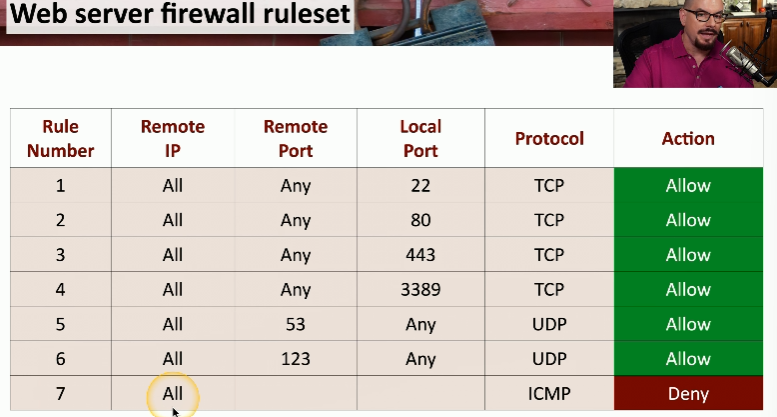

# Secure Baselines
- Establish
    - Need to create the baselines. They can be found from manufacturers 
- Deploy
    - Need to put the baselines into action
- Maintain
    - Update the baselines when needed (i.e. updates, new OS, vulnerabilities)

# Hardening Targets
- Mobile devices
    - Updates are critical for bugs and security patches
    - Segmentation can protect data where company and user data are separated

- Workstations
    -  Automate monthly patches
    - Remove software from the device to reduce the chance of a attack (less options = less vulnerabilities)

- Switches
    - Always change the default credentials
    - Check with manufacturer for any security updates as they are the only ones who will know

- Cloud infrastructure
    - Use least privilege 
    - Configure endpoint detection and response (EDR) to make sure that all devices accessing the cloud are secure
    - Always have backups

- Servers
    - Keep updated (i.e. system updates, service packs, security patches)
    - Follow good practices like complex passwords and limit the number of account a user has
    - Limit network access
    - Monitor and secure using anti-virus/anti-malware

- ICS/SCADA
    - Requires extensive segmentation (limited access to them)

- Embedded systems
    - Perform security patches 
    - Segment them and use firewalls

- RTOS
    - Isolate the system from the rest of the network
    - Run these systems with the MINIMUM amount of services (prevents the potential of an exploit)
    - Use secure communication by leveraging host based firewalls

- IoT devices
    - Perform updates ASAP
    - Segmentation from other devices on a network

# Securing Wireless and Mobile
- Site surveys
    - Determine existing wireless landscapes
    - Identify existing access points
    - Layout and plan for interference
    - Perform the site survey often since things change all the time

- Heat maps
    - Good way to visualize wireless signal strength

#### Mobile
- System admins can control devices by using a mobile device management (MDM) since its a centralized way to view all devices in a organization
    -  Lets admin do stuff like lock after a certain amount of time, require a PIN to use, separate information in the device, have the camera turned off all the time, etc.

- <u>Bring your own device (BYOD)</u>: use personal device for personal use and work
    - Difficult to manage since you have to manage personal info and company info

- Corporate-owned, personally
enabled (COPE)
    - Works similar to a BYOD except the organization buys the device for the employee
    - Information is protected using corporate policies 
    - Choose your own device (CYOD) lets a employee decide what device they want to use

- Cellular networks
    - Can be used to monitor traffic or location across the world

- Wi-Fi
    - Susceptible to on-path attacks and DOS attacks

- Bluetooth
    - Susceptible to attacks like WIFI and cellular networks. Be careful to connecting to anything public since anyone can also connect and exploit your device

# Wireless Security Settings
- <u>Wi-Fi Protected Access 3 (WPA3)</u>: protocol used for security on WIFI
    - Galois/Counter Mode Protocol (GCMP) block cipher code is a stronger encryption than the one used on WPA2 

- <u>AAA/Remote Authentication</u>: tracks resources connecting to a network
    - A = Authentication
    - A = Authorization
    - A = Accounting

- <u>IEEE 802.1X</u>: port based network access control (NAC)
    - You don't get access to the network until you authenticate
    - Uses EAP

- Remote Authentication Dial-In User Service (RADIUS)
    - Common AAA protocols
    - Used not only for dial ins

# Application Security
-<u>Input validation</u>: verifies that anything not expected in the input will not be interpreted by the app

- <u>Secure cookies</u>: information stored on your computer by the browser
    - Used for tracking, personalization, session management
    - Sensitive information should not be saved in a cookie

- <u>Static code analysis (SAST) </u>: automatically scanning an application's source code for vulnerabilities before its executed

- <u>Code signing</u>: digitally signing software to verify its authenticity and integrity to make sure it has not been tampered with

- <u>Sandboxing</u>: the application can not access unrelated resources
    - They play in their own sandbox

- You can monitor your application in real time
    - View blocked attacks
    - Audit logs to get more information
    - Anomaly detection (i.e. unusual file transfers, increase in client access)

# Asset Management
- <u>Acquisition/procurement process</u>: purchasing goods and services from third parties

- Assignment/accounting
    - A central asset tracking system tracks all the products received 
    - Ownership
        - First step in a tracking system
        - Associate with a person
    - Classification
        - Type of asset
        - Hardware
        - Software
    - Monitoring/asset tracking
        - Helps the helpdesk for tracking of devices
        - Inventory (i.e. laptops, desktops, servers, etc.)
        - Enumeration
            - Lists all parts if an asset (i.e. CPU, memory, storage drive, keyboard)

- Disposal/decommissioning
    - Remove all data. It wont be used again

- Destruction
    - Physically destroy hardware

- Certification
    - Destruction of hardware by a third party. There is a confirmation that the hardware is destroyed.
    - Used when a organization does not have time destroy the hardware themselves

- Data retention
    - Backup data
    - Follow compliance (i.e. certain amount of data needs to be kept)
    - Different data types have different procedures

# Vulnerability Scanning
- Vulnerability scans only check what potential vulnerabilities are there like a port scan
    - Not all scans are accurate. Need to review reports to view what is accurate and whats not

- Static analysis
    - Scans for multiple vulnerabilities to help identify security flaws
    - The vulnerabilities are found easily

- Dynamic analysis(Fuzzing)
    - Sends random input to an application in order to see what the output might be (i.e. fault injecting, robustness testing, syntax testing, negative testing)

- Package monitoring
    - Some applications are distributed in a package. You need to confirm the package is legitimate
    - Confirm package is safe before deploying

# Threat Intelligence
- Open-source intelligence (OSINT)
    - Use discussion groups or anything public including the government
    - Commercial data like maps, financials are also usable

- Proprietary/third-party
    - They can analyze threats across multiple organizations simultaneously

- Information-sharing organization
    - Can be private or public organizations
    - The data is shared for critical security details about threats (i.e. Cyber Threat Alliance)
        - Information is uploaded and members can use the information whenever they need it

- Dark web
    - The attacker themselves and the information they've successfully stolen

# Penetration Testing
- <u>Penetration Testing</u>: simulate an attack on your own system
    - Rules of engagement define purpose and scope of the test. Basically it determines what is allowed to be tested and when
    - Once in the system, the goal should be too move across systems (horizontally)
    - Make sure you have a way back into the system (i.e. a back door)
    - Leverage current compromised systems to access other as a stepping stone

# Analyzing Vulnerabilities
- <u>False positive</u>: vulnerability that doesn't really exist
- <u>False negative</u>: vulnerability that does exist but wasn't detected
    - Update signatures to prevent false positives or negatives

- Prioritize
    - Refer to public disclosures when deciding how to categorize vulnerabilities from least important to most important

- <u>Common Vulnerability Scoring System (CVSS)</u>: rating system used to categorize vulnerabilities on a level of big of a threat they are

- <u>Common Vulnerability Enumeration (CVE)</u>: list of vulnerabilities and how important they are

- Vulnerability classification
    - Scanning results when scanning most parts of a system but not everything. The signatures are the key.
    
- <u>Exposure factor</u>: determines how risky a vulnerability is as a percentage

- Environmental variables
    - If a system is isolated it might not be a priority but if its on the public cloud that's used by many users it could be the number one priority. The environment a system is determines how important it is.

- Industry/organizational impact
    - Who is affected by it should an attack happen. Some attacks have bigger affects on other users than others

- Risk tolerance
    - An organization's willingness to accept the potential negative impact of risks, even after mitigation efforts have been applied

# Vulnerability Remediation
- Patching
    - Most common mitigation technique
    - Schedule vulnerability/patches

- Insurance
    - Cybersecurity insurance after an attack happens to get lost money and data and prevent lawsuits
    - It doesn't cover everything

- Segmentation
    - Limit access by separating devices to their own network/VLANs
    - Patching isn't always possible
    - Use internal NGFW

- Compensating controls
    - Makeup for security if patching isn't possible like:
        - Disable the problematic service
        - Revoke access to the application
        - Limit external access
        - Modify internal security controls and software firewalls

- Exceptions and exemptions
    - Some vulnerabilities can't be patched so they will not be taken care of. The severity of these vulnerabilities may not be high so they can be left alone (i.e. a vulnerability that require physical access)

- Validation of remediations
    - Rescan, Audit, and verify the patches/solutions worked

- Reporting
    - Ongoing checks of the system to discover new threats

# Security Monitoring 
- Computing resources 
    - Systems
        - Authentication from strange places and servers (i.e. backups, software versions, activity)
    - Applications
        - Ensure availability and data transfers are working properly
    - Infrastructure
        - Remote access systems and firewalls

- Log aggregation
    - <u>Security Information and Event Manager (SIEM)</u>: a way to consolidate many different logs to a central database
    - Correlation between systems

- Scanning

- Reporting
    - Analyze the collected data to determine what to do next
    - Provides status information
    - Ad hoc information summaries for hypothetical situations

- Archiving
    - May be mandated by law to hold onto certain information

- Alerting
    - Keeps the right people informed
    - Help enable quick response and status information 

- Alert response and remediation/validation
    -  Quarantine
        - Isolate the system from the rest of the network to prevent further attacks
    - Alert tuning
        - Make sure alerts are working properly and prevent false negatives

# Security Tools
- <u>Security Content Automation Protocol (SCAP)</u>: allows tools to identify and act on the same criteria
    - Maintained by NIST
    - Validates the security configuration
    - Confirm patch installs
    - Scan for a security breach
    - Useful i large environments 

- <u>Benchmarks</u>: applying security best practices to everything
    - For a mobile device, good benchmarks would be to disable screenshots, disable screen recordings, prevent voice calls when locked

- Agents/agentless
    - Agents can check if a device is compliant and provide additional detail 
    - It checks the system is working properly but it needs to be maintained updated

- Security information and event management (SIEM)
    - Collects security alerts
    - Can be used to forensic analysis 

- Antivirus
    - Malware refers to the broad malicious software category
    - Anti-virus and anti-malware are now the same thing

- <u>Data loss prevention (DLP)</u>: look and block any data you do NOT want running on a network
    - Stop the data before the attacker gets it

- Simple Network Management Protocol (SNMP) traps
    - Leverage to request statistics from a device
    - Poll devices at fixed intervals

- <u>NetFlow</u>: gathers traffic from all traffic flows
    - Standard collection method
    - Shared communication between devices

- Vulnerability scanners
    - Can check if there are potential vulnerabilities
    - Gather as much helpful information as possible

# Firewalls
- Access lists
- Ports/protocols
    - Helps make forwarding decisions based on protocol and port numbers
    - web server = tcp/80 or tcp/443
    - ssh = tcp/22
    - Microsoft rdp = tcp/3389
    - dns query = udp/53
    - ntp = udp/123

- Rules
    - They're logical paths
    - They can be generic or specific
    - Can have a implicit deny
    - Examples:
        

- Screened subnets
    - Its and additional layer of security between you and the internet

- IDS/IPS
    - Different ways to find malicious traffic
    - Can customize IPs rules. It can take time configure rules (false positives can appear)