# Threat Actors
- <u>Threat Actors</u>: the entity responsible for an event that has an impact on the safety of another entity
    - They can be internal or external
    - They can be funded or have no money with no/little resources
    - They can be sophisticated (knows exactly what they're doing) or know little (i.e. runs a script by accident)
    #### Motives for Actors
    1. Data exfiltration
    2. Espionage
    3. Service disruption
    4. Blackmail
    5. Financial gain
    6. Philosophical/political beliefs
    7. Ethical
    8. Revenge
    9. Disruption/chaos
    10. War

    - <u>Nation states</u>: external entity like government and national security
        - Can have multiple motivations
        - Can perform constant attacks because large amounts of resources
        - Can be sophisticated attacks
    
    - <u>Unskilled attackers</u>: runs pre-made scripts without any knowledge of what's really happening
        - Motivated by disruption or philosophical reasons
        - Can be internal or external
        - Not really sophisticated attacks
        - Not a lot of funding
    
    - <u>Hacktivist</u>: hacker with a purpose
        - Usually external but could be internal
        - Attacks can be really sophisticated
        - Limited funding
    
    - <u>Insider Threat</u>: someone within an organization taking advantage of their knowledge of the organization to perform attacks
        - Extensive resources since they use the organizations resources
        - Medium level of sophistication since they know where the vulnerabilities are
 
     - <u>Organized Crime</u>: professional criminals
        - Very sophisticated
        - Organized
        - Lots of funding
    
    - <u>Shadow IT</u>: professional criminals
        - Very sophisticated
        - Organized
        - Lots of funding
 
 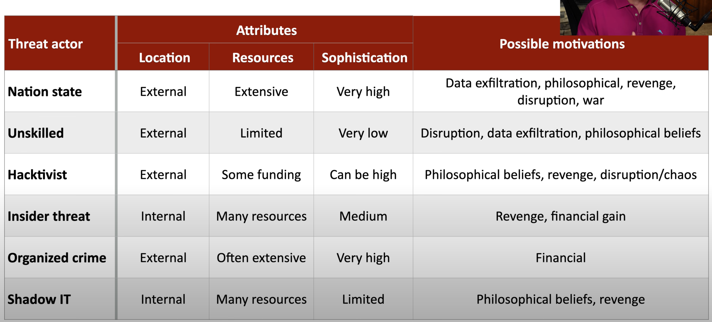

# Common Threat Vectors
- <u>Threat vectors</u>: method used by the attacker to gain access or infect a target
    1. Message Based
        - Phishing attacks
    2. Image based
        - Embedding malicious code in an SVG, PNG, JPG, file 
    3. File based
    4. Voice call
        - Vishing
    5. Removable device
        - USBs
    6. Vulnerable software
    7. Unsupported systems
        - Outdated or old systems
    8. Unsecure networks
    9. Open service ports
    10. Default credentials
        - Basic and common credentials
    11. Supply chain
        - 3rd party configuring hardware to access a system

# Phishing
- <u>Phishing</u>: tricking individuals to revealing sensitive information usually through email, text (smishing), voice call (vishing), etc.

# Impersonation
- The goal is to extract information without the victim realizing it
- An attacker can also steal someone's identity. They can use the victims identity to perform credit card, bank, loan or government fraud

    #### Protection
    - Never volunteer information
    - Don't disclose personal details
    - Always verify before revealing info
    - Verification should be encouraged

# Water Hole Attacks
- <u>Water Hole Attack</u>: where the attacker compromises a legitimate third-party website or service that the victim uses. The goal is to use this trusted location as a stepping stone to infiltrate the attacker's real target (i.e the victim's workplace)
    
    #### Protection
    - Defense in depth (Layers of security)
        - Firewalls and IPS
        - Anti-virus/Anti-malware signature updates

# Other Social Engineering Attacks
- Spreading misinformation through advertisements, social media, etc. in order to cause confusion and division
- Brand impersonation can be used through pop ups (i.e. "You Won!" message), ads, etc.

# Memory Injections
- <u>Memory Injection</u>: inserting malicious code into a running process. The code can obtain permissions and perform unauthorized commands

# Buffer overflow
- <u>Buffer Overflow</u>: storing data in a temporary storage area than it was meant to hold causing data to overflow in adjacent memory locations
    - This can cause adjacent to become corrupted or overwrite the data
    - Overflowing data can also cause the application that uses the data to gain elevated privileges

# Race Conditions
- <u>Race Condition</u>: when 2 or more processes try to access or change the same data at the same time and the result depends on which 1 finishes first leading to unexpected behavior or security issues
    - <u>Time of Check (TOC)</u>: when the system verifies and extracts the data
    - <u>Time of Use (TOU)</u>: when the system uses the data

# Malicious Updates
- Updating OS and applications can improve security because of patches and bug fixes

    #### Best Practices
    - Always have a known good backup
    - Install from trusted sources

- Automatic updates include security checks/digital signatures. They are mostly trustworthy

# OS Vulnerabilities
- OS software are made up of millions lines of code. The more code the higher chance there is a vulnerability

    #### Best Practices
    - Always update OS either monthly or on-demand
    - Test the OS before using (patches might cause problems)
    - Do a reboot
    - Have a backup

# SQL Injection
- <u>SQL Injection</u>: putting your own SQL queries into an application's code to perform commands you want
    - It can allow you to view al db information, delete db information, add users, denial of service, etc.
    - Seeing '1=1' is common indication of a SQL injection

# Cross-site Scripting (XSS)
- <u>Cross-site scripting</u>: an attack where a hacker puts harmful code into a website that other people use. When a victim visits the site, the code runs in their browser and can steal things like login information or cookies.

- <u>Persistent (XSS)</u>: placing the malicious code on a popular website where every time a user clicks/uses the website the victim, the victim is affected

    #### Protection
    - Be careful when clicking untrusted links
    - Consider disabling JS
    - Keep your browser and applications updated

# Hardware Vulnerabilities
- <u>Firmware</u>: software (OS) running inside the hardware device
    - Vendors are the only ones who can fix their hardware

# Virtualization Vulnerabilities
- It is possible to escape a VM and interact with the host OS or hardware. Escaping a VM would mean you have access to the host and control other guest VMs (huge exploit)

- A hypervisor manages the relationship between physical and virtual resources (i.e. RAM, storage space, CPU, availability, etc.). These resources can be reused between VMs (a hypervisor can support 3 VMs with 2 GB of RAM each). Data can accidently be shared between VMs and overwritten

# Cloud-specific Vulnerabilities
- DDoS attacks
- Weak or faulty authentications
- Faulty configurations putting data at risk
- Taking advantaged of unpatched systems

#### Common Attacks
- Web app attacks
- XSS
- <u>Out of bounds write</u>: writing to unauthorized memory areas
- SQL injections

# Supply Chain Vulnerabilities
- These vulnerabilities are any weak points within the entire supply chain process. Either when getting raw materials, dealing with consumers and every step in between. 

#### Vulnerabilities
- Service providers
    - Service providers can be network, utility, office cleaning, payroll/accounting, cloud services, system administration, etc.
    - Audits should be conducted in order to ensure security
- Hardware providers
    - The hardware itself could be compromised
    - Use small suppliers that you trust
    - Have strict control over policies and procedures
- Cisco products
    - Since everything runs through switches and routers, Cisco products have been copied and sold. The products are counterfeit
- Software providers
    - Installing any type of software is risky
    - Digital signatures should be confirmed during installation
    - Even open source software isn't 100% safe

# Misconfiguration Vulnerabilities
#### Vulnerabilities
- Not configuring any or the right permissions (open permissions )
- Unsecured admin accounts
    - Being able to access accounts easily
- Insecure protocols
    - Using the insecure protocols (i.e. HTTP) and not the secure ones (i.e. HTTPS)
- Using default settings
- Open ports and services

# Mobile Device Vulnerabilities
- <u>Jailbreaking/rooting</u>: replacing the existing OS
    - You don't have access to the OS
- <u>Sideloading</u>: installing software or apps without using an app store
    - Prevent this by using the app store

# Zero-day Vulnerabilities
- <u>Zero-day</u>: a newly discovered vulnerability that has no solution or method to fix it
    - This results in a race to exploit the vulnerability or create a patch

# An Overview of Malware
- <u>Malware</u>: software that is performing bad things on a system
    - Malware can
        - Gather information using keystrokes
        - Showing advertising to get money
        - Viruses or worms that infect a system

    - Malware Types and Methods
        - Viruses
        - Worms
        - Ransomware
        - Trojan Horse
        - Rootkit
        - Keylogger
        - Spyware 
        - Bloatware
        - Logic bomb
    - Malware usually appears due to a combination of these types and 

- <u>Ransomware</u>: when an a attacker gets a victims information and encrypts it. The victim can only access it if they do what the attacker says such as pay them money
    - The OS will still work so the victim can see the messages from the attacker

    #### Prevention
    - Backups should be offline so the attacker can not access it
    - Keep the OS up to date
    - Keep apps up to date
    - Keep anti-virus/anti-malware signatures up to date
    - Keep everything up to date

# Viruses and Worms
- <u>Virus</u>: malware that reproduces itself WITH user interaction (i.e. when a user clicks or interacts with something)
    - Reproduces through file systems and networks
    - May or may not cause problems
    - Simple actions like running a program can spread a virus

- <u>Worms</u>: malware that reproduces itself WITHOUT user interaction
    - The reproduce through the network and at the speed of the network

# Spyware and Bloatware
- <u>Spyware</u>: malware that spies on you
    - It can trick you into installing 
    - The browser will monitor you
    - A keylogger capture your keystrokes

    #### Prevention
    - Maintain anti-virus/anti-malware
    - Always know what you're installing
    - Run scans
    - Have backups

- <u>Bloatware</u>: unnecessary apps installed by the manufacturer
    - You don't get a choice since the manufacturer installs it
    - The apps use valuable storage space that could open your system to exploits
    - The system may be slower than expected

# Other Malware Types
- Keylogging
- <u>Logic bomb</u>: waiting for an event to happen that triggers the "bomb"
    - Its difficult to fix recognize a logic bomb but to prevent one you can
        - Have a set of process and procedures
        - Have electronic monitoring
        - Constant auditing
- <u>Rootkit</u>: code that is invisible and can perform tasks such as modify core system files. Its even invisible to the OS and anti-virus software
    - You can use a remover specific to the rootkit to remove one

# Physical Attacks
- Brute force
- RFID cloning (i.e. duplicate access badges)
- Environment attacks (i.e. turning the power off)

# Denial of Service
- <u>Denial of Service</u>: when an attacker forces a service to fail or overload so that no one else can use it
- <u>DDOS</u>: when multiple computers bring down a service

# DNS Attacks
- <u>DNS Attacks</u>: gaining control of a domain name (i.e. www.example.com). This is done by getting access to the DNS server and redirecting users to other websites. This is called domain poisoning/spoofing.
    - <u>URL Hijacking</u>: taking over a URL since the fake URL is very similar to the real one

# Wireless Attacks
- <u>DeAuthentication Attack</u>: a DOS attack that involves disrupting the connection between a wireless device (i.e. phone, computer) and a access point (i.e. router) by sending forged deauthentication frames

- <u>Radio frequency (RF) jamming</u>: transmitting interfering wireless signals preventing other nearby devices from connecting to access points

# On-path Attacks
- <u>On-path Attack (aka man in the middle)</u>: an attacker watching traffic move between 2 locations without either location knowing the attacker is watching
    - The attacker redirects the traffic. They can alter the communication without either requestor or recipient knowing.
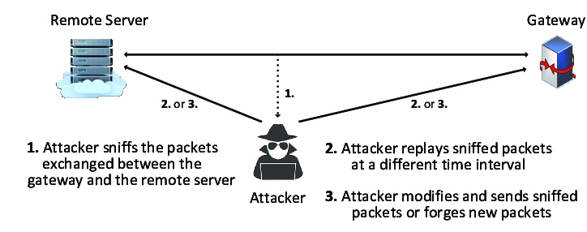

# Replay Attacks
- <u>Replay Attack</u>: an attacker intercepts a request, holds it and then sends it pretending to be the legitimate user
    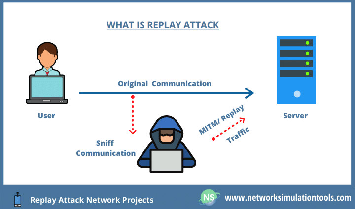
    - An attacker could use this attack to get a users cookies
      - <u>Session hijacking (side jacking)</u>: cookies taken by an attacker
        - With stolen cookies, the attacker can pose as the user
      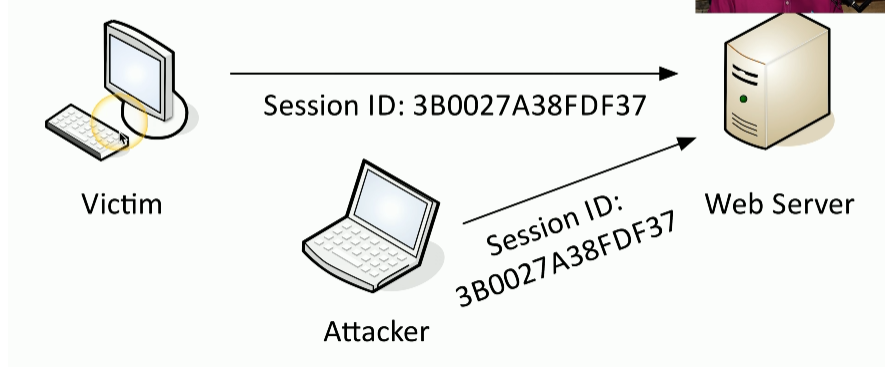
      #### Prevention
      - Encrypt everything (end to end encryption)
      - Encrypt over the network

# Malicious Code
- Attackers can insert malicious code into system that works fine and leverage it to get information
    #### Examples
    - WannaCry ransomware
    - British Airways XSS
    - Estonian Central Health Database (SQL Injection)

# Application Attacks
- Injection Attacks (i.e. SQL Injection)
- Buffer overflows
- Replay Attacks
- <u>Privilege Escalation</u>: gain higher level access to a system
    - The attacker is NOT looking to gain admin access but is moving from user A and its access to user B (horizontal privilege escalation)
    #### Prevention
    - Patch vulnerabilities 
    - Update anti-virus/anti-malware
    - Randomize the locations of where data can be placed
    - Limit the locations data is able to be ran
- <u>Cross-site requests</u>: when a web request is made from one origin(site) to another (i.e. loading a YouTube video on a page)
    - <u>Cross-site request forgery</u>: when a user's browser sends unauthorized commands to a legitimate site
    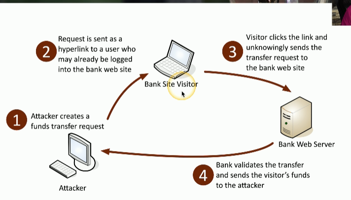
<u>Directory Traversal</u>: read files from a web server that are outside of the websites file directory
    - Its not an attack but it is a web server vulnerability

# Cryptographic Attacks
- <u>Birthday attack</u>: generating multiple versions of plaintext to match a hash
    - The attackers attack the algorithms(i.e. SHA-256) in order to see how well they work
    - <u>Collision</u>: when 2 plain text files have the same hash when encrypted
- <u>Downgrade attack</u>: forcing a system to use a weaker, older, or less secure protocol or encryption method making it vulnerable to exploits
    - SSL stripping (combines a downgrade attack and on-path attack)
    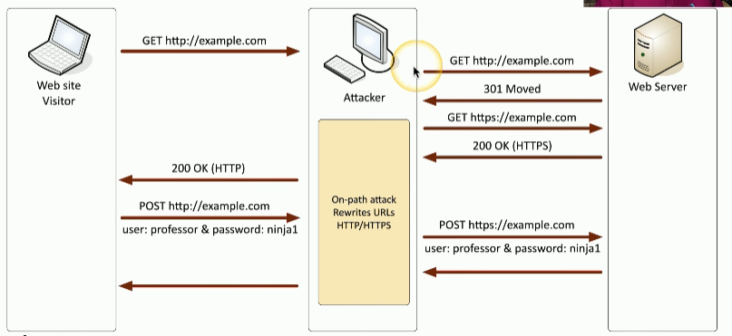

# Password Attacks
- Hashing a password is a 1 way trip. You can not deconstruct the password after its been hashed

- <u>Spraying attack</u>: trying the most common passwords for accounts with weak passwords. 
    - Since these accounts have weak passwords the odds of guessing correctly are high. The attacker will eventually move onto the next vulnerable account. They will also prevent any lockouts, alarms or alerts from going off.

- <u>Brute force</u>: try every possible password combination until the hash is matched

# Indicators of Compromise
- Account lockout
- Session usage (i.e. using an app in different locations at the same time)
- Authentication (i.e. login in/out in different locations within a short time period)
- Resource consumption (i.e. transferring files)
- Resource inaccessibility (i.e.server is down)
- Out of cycle logging (i.e. logs contains events that happen outside of normal hours)
- Missing logs
    - Attackers delete log information to cover tracks
- Published documents

# Segmentation and Access Control
- Segmenting/separating a network in physical, logical or virtual parts can improve security and performance.

    - <u>Access Control List (ACL)</u>: allow or disallow traffic
        - It can be used to restrict access to network devices through the use of limited IP addresses or other ID
        - Example:
        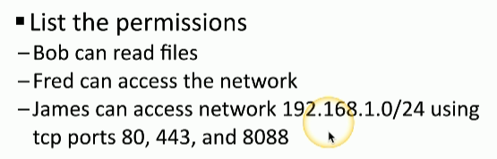
        - Many OS systems use ACLs to provide access to files

    - Application allow/deny lists
        - <u>Allow List</u>: grants permissions only to explicitly specified applications (very restrictive)
        - <u>Deny List</u>: block specific applications while allowing all others (i.e. anti-virus and anti-malware)

# Mitigation Techniques
- Mitigation techniques limit the impact during or after an attack
    - Prevent an attack from happening (i.e. Patching)
    - Limit the amount of data files an attacker can get (i.e. Encryption)
    - Constant monitoring
    - Practice least privilege
    - Apply specific security settings to a system (i.e. configure so only admin can install software on company laptops)
    - Dispose items properly (i.e. destroying a device)

# Harden Techniques
- Harden techniques reduce the attack surface before an attack happens
    - <u>System Hardening</u>: securing OS software, apps, and network devices
    - Encryption
    - Have multiple layers of security for all access points(endpoints)
    - Have host based firewalls
    - Use Host-based Intrusion Prevention Systems to detect and block attacks
    - Close or control open ports
    - Change default settings especially passwords
    - Remove unnecessary software

# Cloud Infrastructures
- Responsibility matrix (i.e. AWS Share Responsibility Model)
- Hybrid cloud (i.e. on-premise and cloud servers in combination)-
- Third party companies are used with a user accounts and the cloud provider
- Infrastructure as Code (i.e. CloudFormation or SAM)
- Serverless architecture (i.e. AWS Lambda functions)
- Microservice architecture and APIs (i.e. using AWS services together instead of 1 application doing everything) 

# Network Infrastructure Concepts
- Switches can be physically located in different locations
- Virtual Local Area Networks (VLAN) are separated logically but not physically (i.e. user A uses 1 portion of the device and user B uses a different portion)
- The software defined network separates different planes of a network such the control and data plane. The control plane handles incoming traffic while the data plane controls where to redirect the traffic.
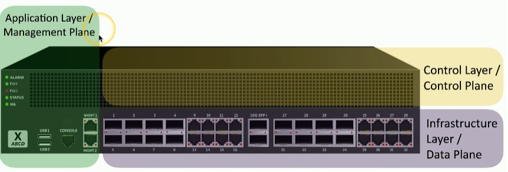

# Other Infrastructure Concepts
- On-premise security
    - Customize your security posture
    - On-site IT team can manage security better
    - Local team maintains uptime and availability
    - Security changes can take time

- Centralized vs decentralized systems
    - Most organizations are physically decentralized (i.e. many locations, cloud providers, OS, etc.)
    - They're difficult to manage and to protect because of many diverse systems
    - Centralized setups are easier to manage but means there is a single point of failure

- Organizations are moving from VMs to containers because container have better security and easier to manage
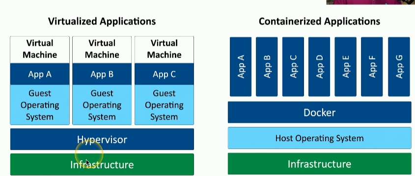

- <u>Internet of Things (IoT)</u>: physical devices that are integrated with a network (i.e. sensors, Fitbit, etc.)

- <u>Supervisory Control and Data Acquisition</u>: lets technicians sit in a centralized control  room, monitor the status of the pieces of equipment and make changes and modification without having to physically visit every piece of equipment
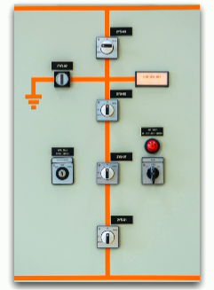

- <u>Real Time Operating System (RTOS)</u>: OS with a deterministic processing schedule (i.e. braking system in a car)

- <u>Embedded Systems</u>: hardware and software designed for a specific function (i.e. smart watches)

# Infrastructure Considerations
1. Availability
    - Its a factor since you want users to be able to access whatever they whenever they want

2. Resiliency 
    - Will be tested once something happens. Its referred to as mean time to repair

3. Money is 
    - Always a factor to consider. 
    - Installation, maintenance, replacements, or tax implications affect cost.

4. Responsiveness
    - Critical especially for interactive applications

5. Scalability 
    -  Can be tested anytime

6. Ease of deployments
    - Important to consider during the product engineering phase

7. Risk transference
    - Use cybersecurity insurance
    - Could result in legal issues with customers
    - Involves recovering loss data

8. Ease of recovery
    - Make recovery easy as possible

9. Patch availability
    - Make sure there are solutions to any bugs or issues 
    - Keep up to date and make sure patches are working properly 

10. Inability to patch
    - Embedded systems (i.e. HVAc controls, time clocks) do not have patching as an option
    - Its best to think about additional security controls when this happens

11. Power
    - Think of backups (i.e. generators)

12. Compute
    - Use multiple CPUs across multiple cloud for intense tasks and scalability

# Secure Infrastructure
- <u>Security Zone</u>: lets you logically separate devices by use or access type
    - Each area is associated with a zone (i.e. trusted, internal, inside, servers, screened, etc.)
    - Makes it easier to simplify security policies (i.e. trusted to untrusted or untrusted to screened)
    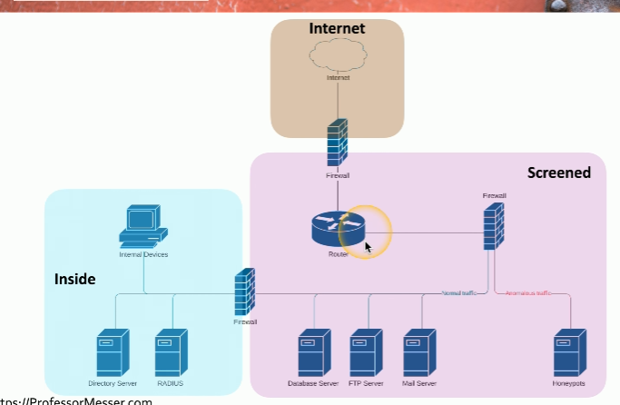

- <u>Attack surfaces</u>: potential openings an attacker can access a network
    - Anything can be a vulnerability
        - Application code
        - Open ports
        - Human error
    - Minimize the surface by auditing code, blocking ports with firewalls, monitoring traffic in real time

- Connectivity
    - Ensure an attacker does not access the network by
        - Securing network cables
        - Application level encryption
        - Network level encryption

# Intrusion Prevention
- <u>Intrusion Prevention System (IPS)</u>: designed to watch traffic as it traverses the network in real time
    - It can block anything that is considered dangerous quickly (i.e. SQL injection)
    - Intrusion Detection System (IDS) can only detect/alarm/alert while a IPS can block
- Fail open = when a system fails and data continues to flow
- Fail closed = when a system fails and data does not flow

- <u>Active monitoring</u>: system is connected inline
    - Data can be blocked in real time as it passes by
    - Intrusion prevention is commonly active
    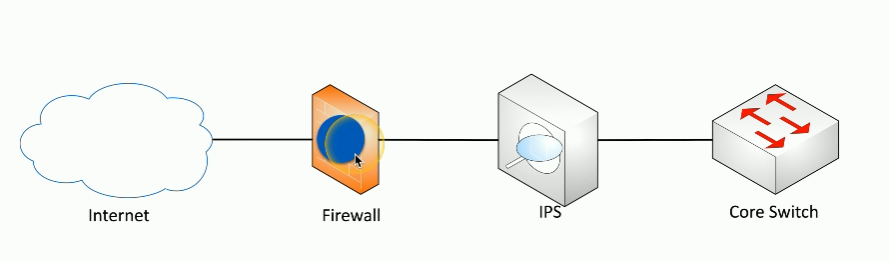

- <u>Passive monitoring</u>: a copy of the network traffic is examined using a tap or port monitor
    - Data cannot be blocked in real time 
    - Intrusion detection is commonly passive
    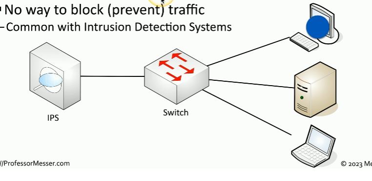

# Network Appliances
- <u>Jump server</u>: a device on the inside of a network that is accessible from the outside
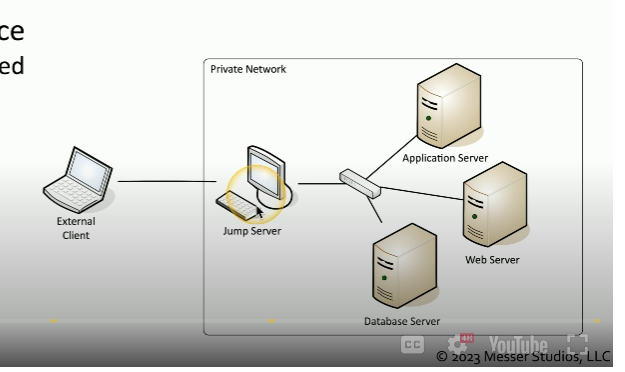

- <u>Proxy server</u>: sits in the middle of devices and make request on behalf of the users
    - Useful for caching, URL filtering, content scanning
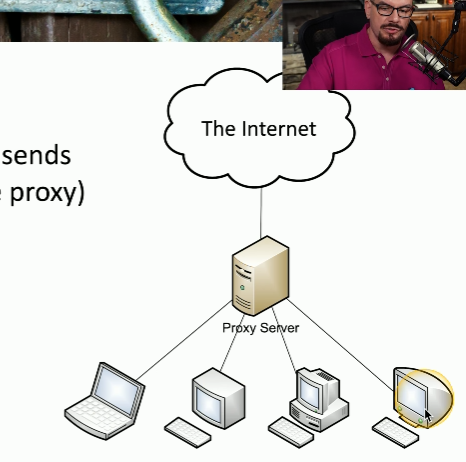

- Proxies
    - Simplest proxy = NAT
    - Application proxies are the most common since they work with different protocols 

- <u>Proxy server</u>: sits in the middle of devices and make request on behalf of the users
    - Useful for caching, URL filtering, content scanning

- <u>Load Balancers</u>: distributes loads to multiple services
    - For large scale implementations and fault tolerance

- Sensors and collectors
    - They compile information from network devices
    - Sensors are IPS and use firewall logs, authentication logs, web server logs. This data is then sent to collectors. Collectors are proprietary consoles and consolidate the data being logged

 # Port Security
 - <u>Port Security</u>: security of the individual interfaces that are on a switch or connection to a wireless access point
     - Uses Extensible Authentication Protocol (EAP)
     - EAP and 802.1X work together so that you can provide login credentials and have those credentials provide you with access to the network

# FireWall Types
- Firewalls can filter traffic by port number or app (i.e. OSI layer 4 or OSI layer 7)
    - Layer 4 = TCP or UDP ports
    - Layer 7 = Application layer
- Firewalls encrypt traffic
- Firewalls can act as routers

- <u>Unified Threat Management (UTM)</u>: older all-in-one firewall that bundles several security tools into a single device
    - Used as all in one box firewall with antivirus and VPN

- <u>Next Generation Firewalls (NGFW)</u>: modern firewall that combines traditional firewall functions with advanced features like deep packet inspection, intrusion prevention, and application awareness
    - Operate at layer 7

- <u>Web Application Firewall (WAF)</u>: protects web applications by filtering, monitoring, and blocking HTTP/HTTPS traffic

# Secure Communication
- <u>VPN</u>: encrypts all private data and sends it across the internet
    - <u>Concentrator</u>: decrypts/encrypts data

- SSL/TLS VPN
     - Used for remote access
     - Uses protocol 443
     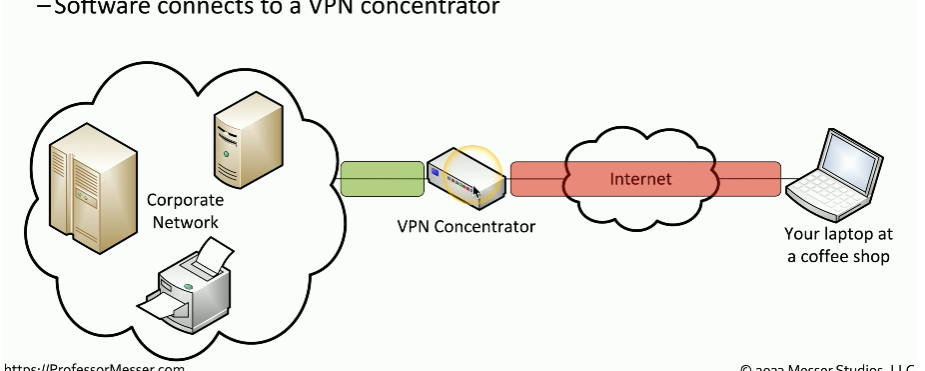

- <u>Software Defined Networking (SDN WAN)</u>: method to connect to web based applications
    - No need to connect to a central point (i.e. data center) before connecting to the cloud anymore
    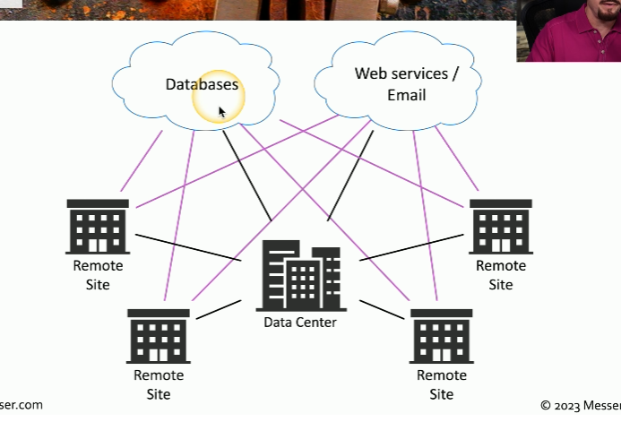

- <u>Secure Access Service Edge (SASE)</u>: secure way to connect to the cloud
    - It replaces the the concentrator for security
    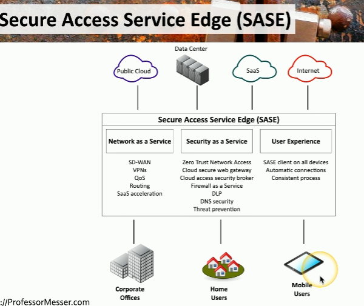

 #### Selection of effective controls
 1. VPN - use SSL/TLS for user access
    - IPsec tunnels for site to site access
 2. SD-WAN - use to manage network connectivity to the cloud
    - Use SASE for security

 # Data Types and Classifications
- <u>Regulated</u>: 3rd party determines how the data should be protected
- <u>Trade secret</u>: secret formulas used by organizations
- <u>Intellectual property</u>: may be publicly visible
- <u>Legal information</u>: i.e court records and documents
- <u>Financial information</u>: i.e customer financials, payment records, etc.
- Human readable vs non-human readable (i.e. barcodes)
    - CSV, XML, JSON are hybrid of both

    - Sensitive = intellectual property, PII, PHI
    - Confidential = very sensitive and must be approved
    - Public/Unclassified = no restrictions on viewing the data
    - Restricted/Private/Classified = restricted access and may require an NDA
    - Critical = data that should always be available

# States of Data
- <u>Data at rest</u>: data stored on a storage device (i.e. hard drive, SSD, flash drive, etc.)
    - The data does not have to be encrypted in order for it to be called data at rest
    - The whole disk can be encrypted, only the database is encrypted or the files/folder level is encrypted
    - Once encrypted, then permissions can be added

- <u>Data in transit</u>: data being moved cross the network
    - Use firewalls or IPS to secure data in motion
    - Use TLS or IPsec to encrypt the data

- <u>Data in use</u>: data being processed in memory
    - Data is almost always decrypted

- <u>Data sovereignty</u>: when data is located in a country and is subject to the laws of that country

- <u>Geolocation</u>: location details
    - Different ways to determine location (i.e. 802.11, mobile providers, GPS)
    - Can limit administrative tasks unless secure area is used